### UC01 — Realizar Login

| Campo | Conteúdo |
|---|---|
| **Ator Principal** | Usuário (Aluno, Recepcionista, Instrutor, Gerente) |
| **Objetivo** | Permitir que o usuário acesse o sistema com autenticação segura. |

**Pré-condições**
- Usuário deve possuir cadastro ativo no sistema.

**Pós-condições**
- Sessão iniciada com sucesso e usuário redirecionado à tela inicial conforme seu perfil.

**Fluxo Principal**
1. O usuário acessa a tela de login.
2. O usuário informa e-mail e senha.
3. O sistema valida as credenciais.
4. O sistema autentica o usuário.
5. O sistema redireciona o usuário para a tela inicial de acordo com o perfil (RN06).

**Fluxos Alternativos**
- **A1 — Senha incorreta:** O sistema exibe mensagem de erro e solicita nova tentativa.
- **A2 — Conta bloqueada:** O sistema impede o login e orienta o usuário a recuperar o acesso.
- **A3 — Usuário não encontrado:** O sistema exibe mensagem informando que o cadastro não existe.

**Requisitos Relacionados**

| RF | RNF | RN |
|---|---|---|
| _(pré-requisito geral)_ | RNF02, RNF03, RNF04 | RN06 |

### DA01 — Realizar Login (UC01)

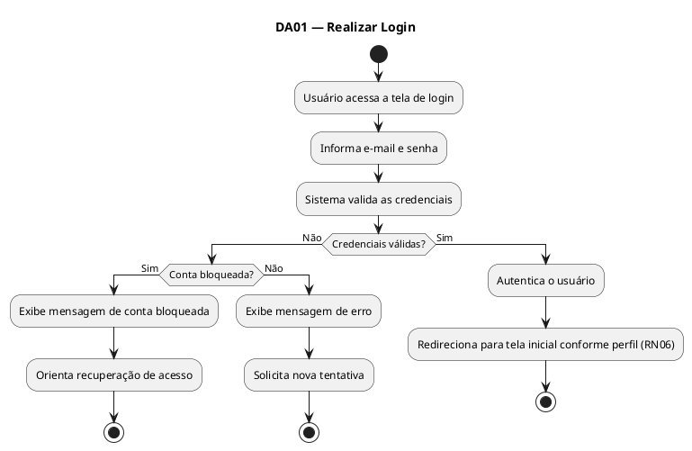

---

### UC02 — Cadastrar Aluno

| Campo | Conteúdo |
|---|---|
| **Ator Principal** | Recepcionista |
| **Objetivo** | Registrar um novo aluno no sistema com todos os dados necessários para matrícula. |

**Pré-condições**
- Recepcionista autenticado no sistema.
- Plano a ser contratado deve existir e estar ativo (RF02).

**Pós-condições**
- Aluno cadastrado e com matrícula ativa no sistema.
- Cartão RFID vinculado ao aluno.

**Fluxo Principal**
1. O recepcionista acessa o módulo de matrículas.
2. O recepcionista preenche os dados pessoais do aluno (nome, CPF, data de nascimento, contato, endereço).
3. O recepcionista seleciona o plano a ser contratado.
4. O sistema valida os dados informados.
5. O sistema registra o aluno e gera um código de matrícula.
6. O sistema vincula o cartão RFID ao aluno.
7. O sistema confirma o cadastro.

**Fluxos Alternativos**
- **A1 — CPF já cadastrado:** O sistema alerta que o CPF já existe e exibe os dados do aluno existente.
- **A2 — Dados inválidos:** O sistema exibe mensagem de erro indicando os campos inválidos.
- **A3 — Plano indisponível:** O sistema exibe apenas os planos ativos para seleção.

**Requisitos Relacionados**

| RF | RNF | RN |
|---|---|---|
| RF01, RF02, RF05 | RNF02, RNF04 | RN06 |

### DA02 — Cadastrar Aluno (UC02)

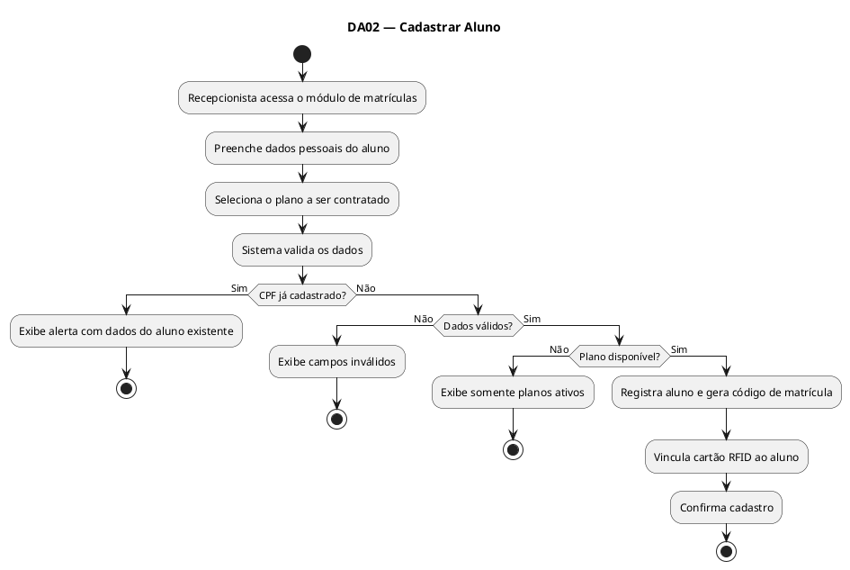

---

### UC03 — Gerenciar Planos

| Campo | Conteúdo |
|---|---|
| **Ator Principal** | Gerente |
| **Objetivo** | Criar, editar, ativar e desativar planos oferecidos pela academia. |

**Pré-condições**
- Gerente autenticado no sistema.

**Pós-condições**
- Plano criado, editado, ativado ou desativado conforme ação realizada.

**Fluxo Principal**
1. O gerente acessa o módulo de planos.
2. O gerente seleciona a ação desejada: criar, editar, ativar ou desativar.
3. Para criar: o gerente preenche nome, tipo, valor e modalidades inclusas.
4. O sistema valida os dados.
5. O sistema salva as alterações e confirma a operação.

**Fluxos Alternativos**
- **A1 — Plano com nome duplicado:** O sistema alerta que já existe um plano com o mesmo nome.
- **A2 — Desativar plano com alunos ativos:** O sistema exibe aviso sobre a quantidade de alunos afetados e solicita confirmação.

**Requisitos Relacionados**

| RF | RNF | RN |
|---|---|---|
| RF02 | RNF04, RNF05 | RN06 |

### DA03 — Gerenciar Planos (UC03)

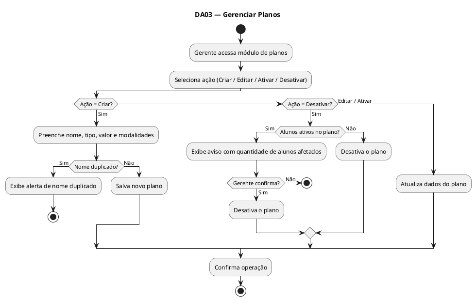

---

### UC04 — Registrar Pagamento

| Campo | Conteúdo |
|---|---|
| **Ator Principal** | Recepcionista |
| **Objetivo** | Registrar o pagamento da mensalidade de um aluno e atualizar sua situação de regularidade. |

**Pré-condições**
- Recepcionista autenticado no sistema.
- Aluno deve estar cadastrado.

**Pós-condições**
- Pagamento registrado.
- Situação do aluno atualizada para "regular" automaticamente.

**Fluxo Principal**
1. O recepcionista acessa o módulo de pagamentos.
2. O recepcionista busca o aluno pelo nome ou CPF.
3. O sistema exibe a mensalidade em aberto.
4. O recepcionista seleciona a forma de pagamento (dinheiro, cartão ou PIX).
5. O sistema registra o pagamento integral.
6. O sistema atualiza automaticamente a situação do aluno para regular (RN07).
7. O sistema emite comprovante de pagamento.

**Fluxos Alternativos**
- **A1 — Aluno não encontrado:** O sistema exibe mensagem de erro e solicita nova busca.
- **A2 — Tentativa de pagamento parcial:** O sistema bloqueia a operação e informa que pagamentos parciais não são permitidos (RN04).
- **A3 — Pagamento online (boleto/cartão):** O sistema gera boleto ou link de pagamento e envia ao aluno.

**Requisitos Relacionados**

| RF | RNF | RN |
|---|---|---|
| RF03, RF04, RF10 | RNF02, RNF03 | RN04, RN07 |

### DA04 — Registrar Pagamento (UC04)

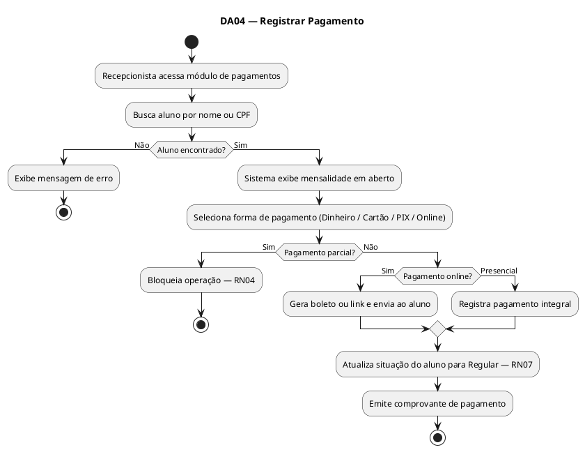

---

### UC05 — Verificar Regularidade do Aluno

| Campo | Conteúdo |
|---|---|
| **Ator Principal** | Sistema (automático) / Recepcionista |
| **Objetivo** | Verificar se o aluno está com a mensalidade em dia antes de liberar acesso ou serviços. |

**Pré-condições**
- Aluno deve estar cadastrado no sistema.

**Pós-condições**
- Situação do aluno exibida (regular ou inadimplente).

**Fluxo Principal**
1. O sistema recebe solicitação de verificação (via catraca, recepcionista ou agendamento).
2. O sistema consulta a data de vencimento da mensalidade do aluno.
3. O sistema verifica se o pagamento está em dia.
4. O sistema retorna o status: "Regular" ou "Inadimplente".

**Fluxos Alternativos**
- **A1 — Aluno inadimplente há mais de 5 dias:** O sistema bloqueia o acesso e notifica o aluno sobre a pendência (RN01).
- **A2 — Aluno com vencimento próximo:** O sistema envia notificação prévia ao aluno (RF10).

**Requisitos Relacionados**

| RF | RNF | RN |
|---|---|---|
| RF04, RF10 | RNF01, RNF03 | RN01, RN07 |

### DA05 — Verificar Regularidade do Aluno (UC05)

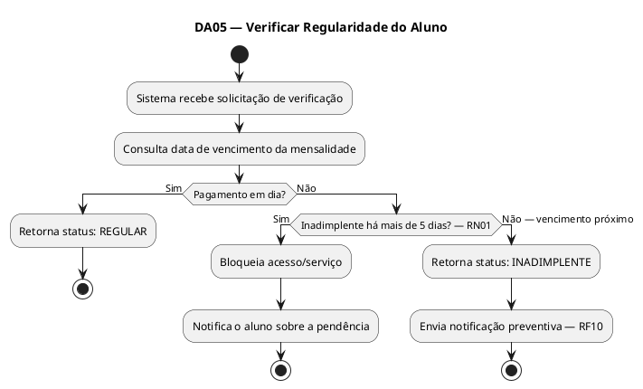

---

### UC06 — Controlar Acesso pela Catraca (RFID)

| Campo | Conteúdo |
|---|---|
| **Ator Principal** | Sistema de Catraca (API Externa) / Aluno |
| **Objetivo** | Validar a entrada do aluno na academia por meio do cartão RFID integrado à catraca. |

**Pré-condições**
- Aluno possui cartão RFID ativo vinculado ao seu cadastro.
- Sistema de catraca integrado via API REST.

**Pós-condições**
- Acesso liberado ou negado registrado no histórico.
- Log de entrada criado.

**Fluxo Principal**
1. O aluno aproxima o cartão RFID da catraca.
2. A catraca envia o código RFID ao sistema via API REST (RNF06).
3. O sistema identifica o aluno pelo RFID.
4. O sistema verifica a regularidade do aluno (UC05).
5. O sistema retorna autorização para a catraca.
6. A catraca libera a entrada.
7. O sistema registra o acesso no histórico.

**Fluxos Alternativos**
- **A1 — Aluno inadimplente:** O sistema retorna negativa; a catraca bloqueia a entrada e exibe mensagem de alerta.
- **A2 — RFID não reconhecido:** O sistema retorna erro; catraca bloqueia e solicita atendimento na recepção.
- **A3 — Falha na comunicação com a API:** A catraca registra a tentativa e pode operar em modo offline temporário.

**Requisitos Relacionados**

| RF | RNF | RN |
|---|---|---|
| RF05, RF04 | RNF01, RNF03, RNF06 | RN01 |

### DA06 — Controlar Acesso pela Catraca (UC06)

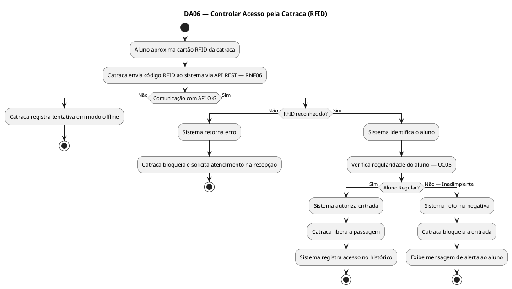

---

### UC07 — Agendar Aula

| Campo | Conteúdo |
|---|---|
| **Ator Principal** | Aluno |
| **Objetivo** | Permitir que o aluno visualize os horários disponíveis e reserve uma vaga em uma aula. |

**Pré-condições**
- Aluno autenticado e com situação regular.
- Existir aulas disponíveis com vagas.

**Pós-condições**
- Reserva confirmada e vaga deduzida do total disponível.
- Notificação de confirmação enviada ao aluno.

**Fluxo Principal**
1. O aluno acessa o módulo de agendamento.
2. O sistema exibe as aulas disponíveis com horários e vagas restantes.
3. O aluno seleciona a aula desejada.
4. O sistema verifica disponibilidade de vagas (RN02).
5. O sistema confirma o agendamento.
6. O sistema envia notificação de confirmação ao aluno (RF10).

**Fluxos Alternativos**
- **A1 — Aula sem vagas:** O sistema bloqueia o agendamento e informa que a aula está lotada (RN02).
- **A2 — Aluno inadimplente:** O sistema bloqueia o agendamento e redireciona para regularização.
- **A3 — Aula já agendada pelo aluno:** O sistema informa que o aluno já possui reserva nesse horário.

**Requisitos Relacionados**

| RF | RNF | RN |
|---|---|---|
| RF06, RF04, RF10 | RNF03, RNF04 | RN01, RN02 |

### DA07 — Agendar Aula (UC07)

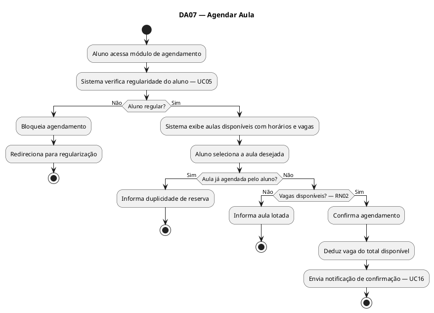

---

### UC08 — Cancelar Agendamento

| Campo | Conteúdo |
|---|---|
| **Ator Principal** | Aluno |
| **Objetivo** | Permitir que o aluno cancele uma reserva de aula previamente realizada. |

**Pré-condições**
- Aluno autenticado.
- Aluno possui reserva ativa para a aula.
- Cancelamento realizado com pelo menos 1 hora de antecedência (RN03).

**Pós-condições**
- Reserva cancelada e vaga devolvida ao total disponível.

**Fluxo Principal**
1. O aluno acessa o módulo de agendamentos.
2. O aluno visualiza suas reservas ativas.
3. O aluno seleciona a aula que deseja cancelar.
4. O sistema verifica se o cancelamento está dentro do prazo permitido (RN03).
5. O sistema cancela a reserva.
6. O sistema devolve a vaga para a aula.
7. O sistema confirma o cancelamento ao aluno.

**Fluxos Alternativos**
- **A1 — Cancelamento fora do prazo:** O sistema bloqueia o cancelamento e informa que o prazo de 1 hora já passou (RN03).
- **A2 — Aula já encerrada:** O sistema informa que não é possível cancelar uma aula já realizada.

**Requisitos Relacionados**

| RF | RNF | RN |
|---|---|---|
| RF06 | RNF03, RNF04 | RN03 |

### DA08 — Cancelar Agendamento (UC08)

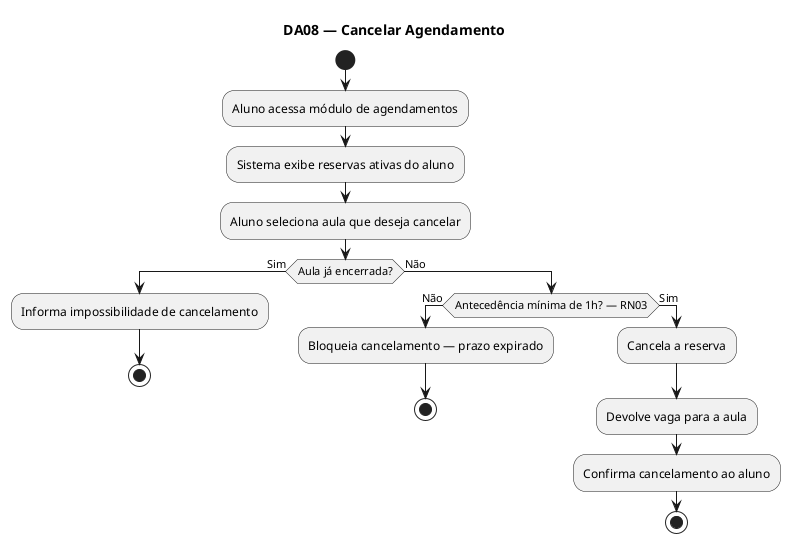

---

### UC09 — Registrar Presença em Aula

| Campo | Conteúdo |
|---|---|
| **Ator Principal** | Instrutor |
| **Objetivo** | Registrar a presença dos alunos em uma aula ministrada. |

**Pré-condições**
- Instrutor autenticado no sistema.
- Aula em andamento ou recém-encerrada.
- Alunos com reserva confirmada para a aula.

**Pós-condições**
- Presença dos alunos registrada no histórico da aula.

**Fluxo Principal**
1. O instrutor acessa o módulo de lista de presença.
2. O sistema exibe a lista de alunos com reserva na aula atual.
3. O instrutor marca os alunos presentes.
4. O sistema salva o registro de presença.
5. O sistema confirma o registro ao instrutor.

**Fluxos Alternativos**
- **A1 — Aluno sem reserva comparecer:** O instrutor pode registrar presença avulsa, se houver vaga disponível.
- **A2 — Falha ao salvar:** O sistema exibe mensagem de erro e solicita nova tentativa.

**Requisitos Relacionados**

| RF | RNF | RN |
|---|---|---|
| RF07 | RNF01, RNF04 | RN06 |

### DA09 — Registrar Presença em Aula (UC09)

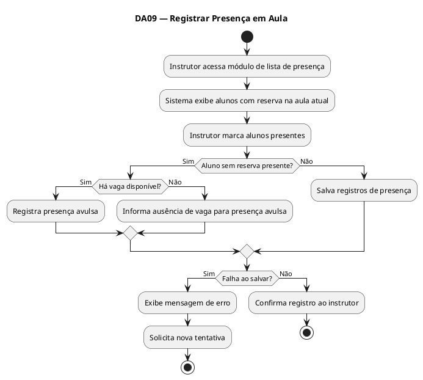

---

### UC10 — Realizar Avaliação Física

| Campo | Conteúdo |
|---|---|
| **Ator Principal** | Instrutor |
| **Objetivo** | Registrar os dados da avaliação física de um aluno (peso, IMC, percentual de gordura etc.). |

**Pré-condições**
- Instrutor autenticado no sistema.
- Aluno ativo e regular no sistema (RN05).

**Pós-condições**
- Avaliação física salva no histórico do aluno.
- Notificação enviada ao aluno informando a disponibilidade da avaliação (RF10).

**Fluxo Principal**
1. O instrutor acessa o módulo de avaliações físicas.
2. O instrutor busca o aluno pelo nome ou matrícula.
3. O sistema verifica se o aluno está ativo e regular (RN05).
4. O instrutor preenche os dados da avaliação (peso, altura, IMC, % de gordura, etc.).
5. O instrutor pode anexar arquivos complementares.
6. O sistema salva a avaliação.
7. O sistema notifica o aluno sobre a nova avaliação disponível (RF10).

**Fluxos Alternativos**
- **A1 — Aluno inadimplente:** O sistema bloqueia a realização da avaliação e informa o motivo (RN05).
- **A2 — Aluno inativo:** O sistema bloqueia a avaliação e exibe o status do aluno.
- **A3 — Erro no upload de arquivo:** O sistema exibe mensagem de erro e solicita novo envio.

**Requisitos Relacionados**

| RF | RNF | RN |
|---|---|---|
| RF08, RF04, RF10 | RNF02, RNF04 | RN05, RN06 |

### DA10 — Realizar Avaliação Física (UC10)

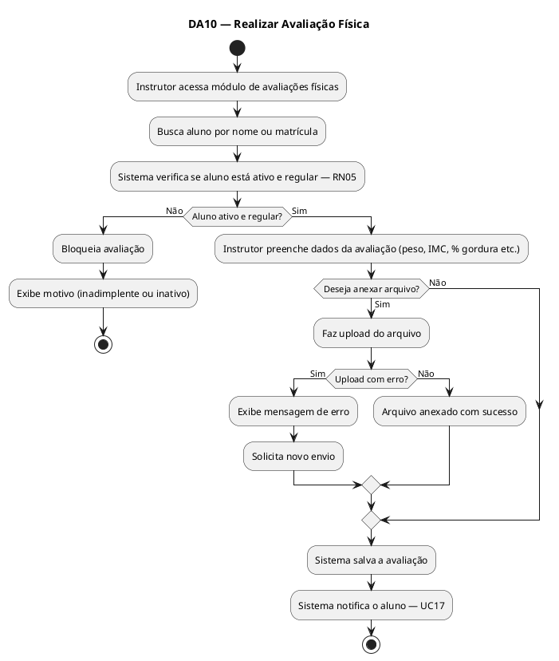

---

### UC11 — Emitir Relatório de Inadimplência

| Campo | Conteúdo |
|---|---|
| **Ator Principal** | Gerente |
| **Objetivo** | Gerar relatório com a lista de alunos inadimplentes para análise e tomada de decisão. |

**Pré-condições**
- Gerente autenticado no sistema.

**Pós-condições**
- Relatório de inadimplência gerado e disponível para visualização ou download.

**Fluxo Principal**
1. O gerente acessa o módulo de relatórios gerenciais.
2. O gerente seleciona "Relatório de Inadimplência".
3. O gerente define filtros opcionais (período, plano, unidade).
4. O sistema processa os dados e gera o relatório.
5. O sistema exibe o relatório com nome, CPF, plano, valor e dias em atraso.
6. O gerente pode exportar o relatório em PDF ou planilha.

**Fluxos Alternativos**
- **A1 — Nenhum inadimplente no período:** O sistema exibe mensagem informando que não há registros para o filtro aplicado.
- **A2 — Erro na geração:** O sistema exibe mensagem de erro e registra log.

**Requisitos Relacionados**

| RF | RNF | RN |
|---|---|---|
| RF09, RF04 | RNF03, RNF05 | RN01, RN06 |

### DA11 — Emitir Relatório de Inadimplência (UC11)

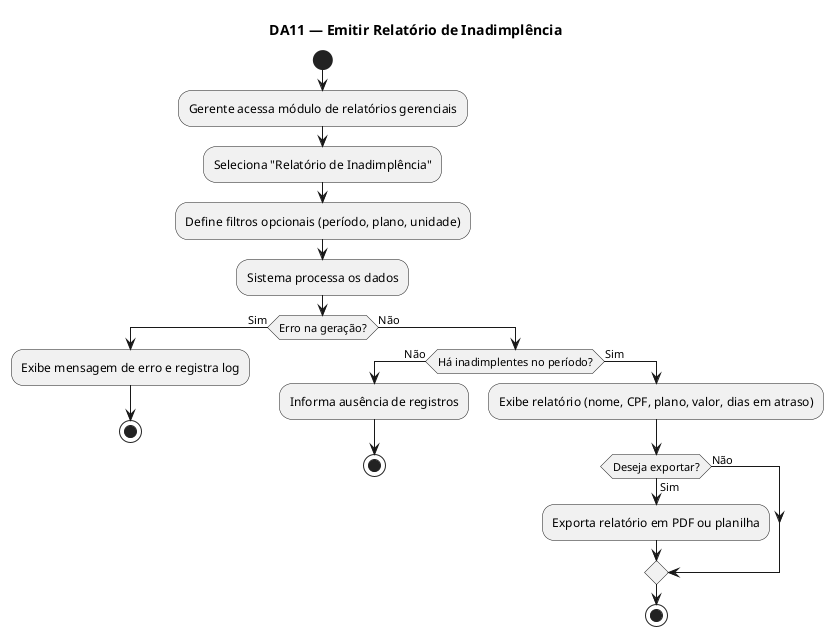

---

### UC12 — Emitir Relatório de Alunos Ativos

| Campo | Conteúdo |
|---|---|
| **Ator Principal** | Gerente |
| **Objetivo** | Gerar relatório com a lista de alunos ativos na academia. |

**Pré-condições**
- Gerente autenticado no sistema.

**Pós-condições**
- Relatório de alunos ativos gerado e disponível.

**Fluxo Principal**
1. O gerente acessa o módulo de relatórios gerenciais.
2. O gerente seleciona "Relatório de Alunos Ativos".
3. O gerente define filtros opcionais (plano, período, modalidade).
4. O sistema processa e gera o relatório.
5. O sistema exibe nome, matrícula, plano e data de vencimento de cada aluno.
6. O gerente pode exportar o relatório.

**Fluxos Alternativos**
- **A1 — Nenhum aluno ativo no filtro:** O sistema informa que não há registros para os critérios selecionados.

**Requisitos Relacionados**

| RF | RNF | RN |
|---|---|---|
| RF09 | RNF03, RNF05 | RN06 |

### DA12 — Emitir Relatório de Alunos Ativos (UC12)

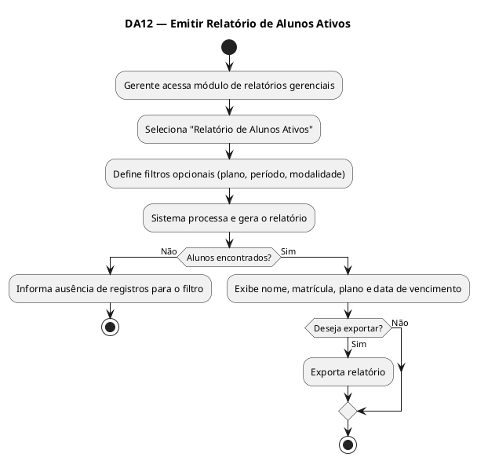

---

### UC13 — Emitir Relatório de Histórico de Acessos

| Campo | Conteúdo |
|---|---|
| **Ator Principal** | Gerente |
| **Objetivo** | Gerar relatório com o histórico de entradas dos alunos na academia registradas via catraca. |

**Pré-condições**
- Gerente autenticado no sistema.

**Pós-condições**
- Relatório de acessos gerado e disponível.

**Fluxo Principal**
1. O gerente acessa o módulo de relatórios.
2. O gerente seleciona "Histórico de Acessos".
3. O gerente define filtros (aluno, período, unidade).
4. O sistema consulta os logs da catraca e gera o relatório.
5. O sistema exibe data, hora e resultado (liberado/negado) de cada acesso.
6. O gerente pode exportar o relatório.

**Fluxos Alternativos**
- **A1 — Nenhum acesso no período:** O sistema informa que não há registros para o filtro selecionado.

**Requisitos Relacionados**

| RF | RNF | RN |
|---|---|---|
| RF09, RF05 | RNF03, RNF05 | RN06 |

### DA13 — Emitir Relatório de Histórico de Acessos (UC13)

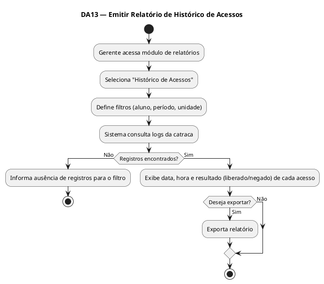

---

### UC14 — Emitir Relatório de Ocupação das Aulas

| Campo | Conteúdo |
|---|---|
| **Ator Principal** | Gerente |
| **Objetivo** | Gerar relatório com dados de ocupação e frequência das aulas oferecidas. |

**Pré-condições**
- Gerente autenticado no sistema.

**Pós-condições**
- Relatório de ocupação gerado e disponível.

**Fluxo Principal**
1. O gerente acessa o módulo de relatórios.
2. O gerente seleciona "Ocupação das Aulas".
3. O gerente define filtros (modalidade, instrutor, período).
4. O sistema processa os dados de agendamentos e presenças.
5. O sistema exibe taxa de ocupação, número de alunos e capacidade por aula.
6. O gerente pode exportar o relatório.

**Fluxos Alternativos**
- **A1 — Nenhuma aula no período:** O sistema informa ausência de registros.

**Requisitos Relacionados**

| RF | RNF | RN |
|---|---|---|
| RF09, RF06, RF07 | RNF03, RNF05 | RN02, RN06 |

### DA14 — Emitir Relatório de Ocupação das Aulas (UC14)

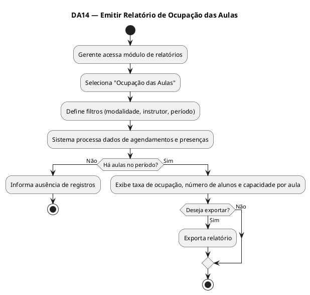

---

### UC15 — Enviar Notificação de Vencimento de Mensalidade

| Campo | Conteúdo |
|---|---|
| **Ator Principal** | Sistema (automático) |
| **Objetivo** | Notificar o aluno sobre o próximo vencimento da mensalidade para evitar inadimplência. |

**Pré-condições**
- Aluno cadastrado com e-mail ou telefone válido.
- Mensalidade próxima ao vencimento (ex.: 5 dias antes).

**Pós-condições**
- Notificação enviada e registrada no histórico de comunicações.

**Fluxo Principal**
1. O sistema executa rotina automática diária.
2. O sistema identifica alunos com vencimento próximo.
3. O sistema gera a mensagem de notificação personalizada.
4. O sistema envia a notificação por e-mail e/ou SMS.
5. O sistema registra o envio no histórico.

**Fluxos Alternativos**
- **A1 — Falha no envio:** O sistema registra o erro e agenda nova tentativa.
- **A2 — Aluno sem contato cadastrado:** O sistema registra a pendência para ação manual da recepção.

**Requisitos Relacionados**

| RF | RNF | RN |
|---|---|---|
| RF10, RF04 | RNF01, RNF02 | RN01 |

### DA15 — Enviar Notificação de Vencimento (UC15)

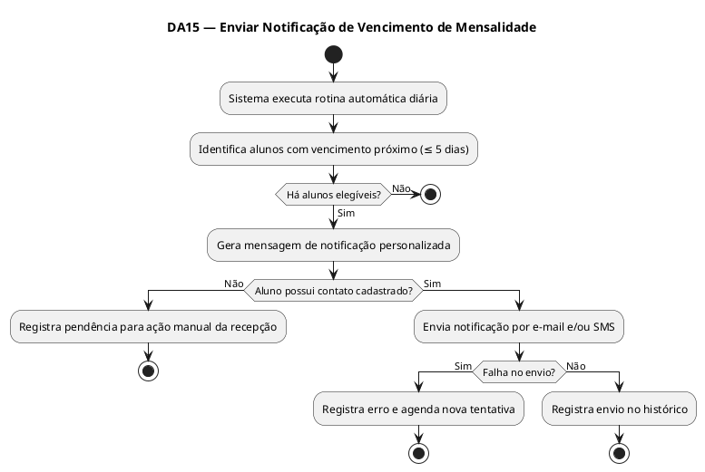

---

### UC16 — Enviar Notificação de Confirmação de Agendamento

| Campo | Conteúdo |
|---|---|
| **Ator Principal** | Sistema (automático) |
| **Objetivo** | Confirmar ao aluno, via notificação, que seu agendamento de aula foi realizado com sucesso. |

**Pré-condições**
- Agendamento de aula concluído com sucesso (UC07).
- Aluno com e-mail ou telefone válido cadastrado.

**Pós-condições**
- Notificação de confirmação enviada ao aluno.

**Fluxo Principal**
1. O sistema detecta a confirmação de um novo agendamento.
2. O sistema gera mensagem com dados da aula (modalidade, data, hora, instrutor).
3. O sistema envia a notificação ao aluno.
4. O sistema registra o envio.

**Fluxos Alternativos**
- **A1 — Falha no envio:** O sistema registra o erro e tenta reenviar.

**Requisitos Relacionados**

| RF | RNF | RN |
|---|---|---|
| RF10, RF06 | RNF01, RNF04 | RN02 |

### DA16 — Enviar Notificação de Confirmação de Agendamento (UC16)

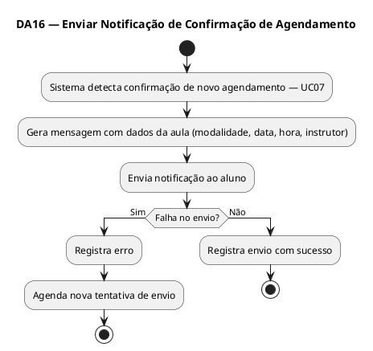

---

### UC17 — Notificar Liberação de Nova Avaliação Física

| Campo | Conteúdo |
|---|---|
| **Ator Principal** | Sistema (automático) |
| **Objetivo** | Informar ao aluno que uma nova avaliação física está disponível para agendamento. |

**Pré-condições**
- Aluno ativo e regular.
- Período mínimo desde a última avaliação atingido (conforme regra da academia).

**Pós-condições**
- Notificação enviada ao aluno.

**Fluxo Principal**
1. O sistema executa rotina de verificação periódica.
2. O sistema identifica alunos elegíveis para nova avaliação.
3. O sistema gera e envia notificação informando a disponibilidade.
4. O sistema registra o envio.

**Fluxos Alternativos**
- **A1 — Aluno inadimplente:** O sistema não envia a notificação até regularização.
- **A2 — Falha no envio:** O sistema registra e agenda reenvio.

**Requisitos Relacionados**

| RF | RNF | RN |
|---|---|---|
| RF10, RF08 | RNF01 | RN05 |

### DA17 — Notificar Liberação de Avaliação Física (UC17)

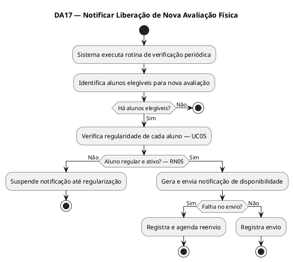

---

### UC18 — Consultar Histórico de Avaliações Físicas

| Campo | Conteúdo |
|---|---|
| **Ator Principal** | Aluno / Instrutor |
| **Objetivo** | Visualizar o histórico de avaliações físicas realizadas pelo aluno ao longo do tempo. |

**Pré-condições**
- Usuário autenticado.
- Aluno deve ter pelo menos uma avaliação registrada.

**Pós-condições**
- Histórico de avaliações exibido.

**Fluxo Principal**
1. O usuário acessa o módulo de avaliações físicas.
2. O sistema lista todas as avaliações do aluno em ordem cronológica.
3. O usuário seleciona uma avaliação para visualizar os detalhes.
4. O sistema exibe os dados completos e arquivos anexados.

**Fluxos Alternativos**
- **A1 — Nenhuma avaliação registrada:** O sistema informa que não há avaliações no histórico.
- **A2 — Instrutor consulta avaliação de aluno:** O instrutor busca o aluno pelo nome/matrícula e acessa o histórico.

**Requisitos Relacionados**

| RF | RNF | RN |
|---|---|---|
| RF08 | RNF02, RNF04 | RN06 |

### DA18 — Consultar Histórico de Avaliações Físicas (UC18)

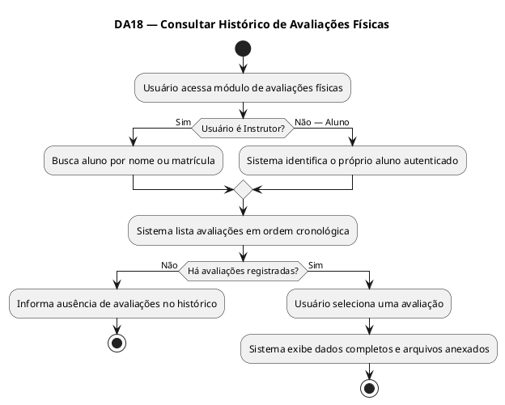

---

### UC19 — Editar Dados Cadastrais do Aluno

| Campo | Conteúdo |
|---|---|
| **Ator Principal** | Recepcionista |
| **Objetivo** | Atualizar informações cadastrais de um aluno já matriculado (contato, endereço, plano etc.). |

**Pré-condições**
- Recepcionista autenticado no sistema.
- Aluno já cadastrado.

**Pós-condições**
- Dados do aluno atualizados no sistema.

**Fluxo Principal**
1. O recepcionista acessa o módulo de cadastro de alunos.
2. O recepcionista busca o aluno pelo nome ou CPF.
3. O sistema exibe os dados atuais do aluno.
4. O recepcionista edita os campos desejados.
5. O sistema valida os dados alterados.
6. O sistema salva as alterações e confirma a atualização.

**Fluxos Alternativos**
- **A1 — Dados inválidos:** O sistema exibe mensagem de erro indicando os campos com problema.
- **A2 — Aluno não encontrado:** O sistema exibe mensagem e solicita nova busca.

**Requisitos Relacionados**

| RF | RNF | RN |
|---|---|---|
| RF01, RF02 | RNF02, RNF04 | RN06 |

### DA19 — Editar Dados Cadastrais do Aluno (UC19)

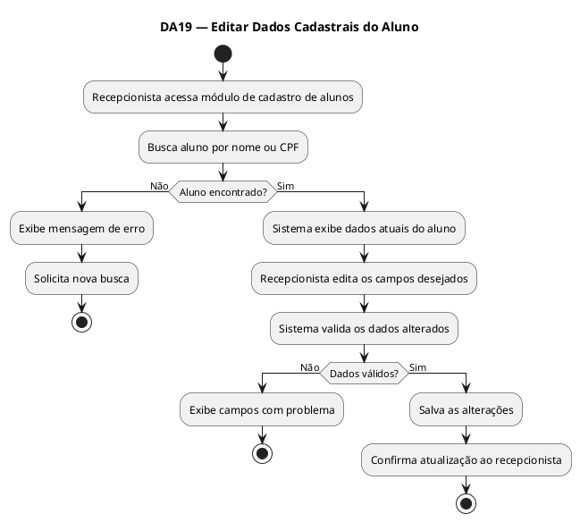

---

### UC20 — Desativar Matrícula de Aluno

| Campo | Conteúdo |
|---|---|
| **Ator Principal** | Recepcionista / Gerente |
| **Objetivo** | Inativar o cadastro de um aluno que solicitou cancelamento ou que será desligado da academia. |

**Pré-condições**
- Usuário autenticado (Recepcionista ou Gerente).
- Aluno cadastrado e com matrícula ativa.

**Pós-condições**
- Matrícula do aluno inativada.
- Acesso via catraca bloqueado automaticamente.
- Agendamentos futuros cancelados.

**Fluxo Principal**
1. O usuário acessa o módulo de cadastro de alunos.
2. O usuário busca e seleciona o aluno.
3. O usuário seleciona a opção "Desativar Matrícula".
4. O sistema solicita confirmação da ação.
5. O usuário confirma.
6. O sistema inativa a matrícula e bloqueia o RFID.
7. O sistema cancela todos os agendamentos futuros do aluno.
8. O sistema registra a data e motivo do desligamento.

**Fluxos Alternativos**
- **A1 — Aluno com pendências financeiras:** O sistema exibe alerta sobre débitos pendentes antes de confirmar a desativação.
- **A2 — Cancelamento da ação:** O usuário cancela e o sistema mantém a matrícula ativa.

**Requisitos Relacionados**

| RF | RNF | RN |
|---|---|---|
| RF01, RF05, RF06 | RNF02, RNF04 | RN06 |

### DA20 — Desativar Matrícula de Aluno (UC20)

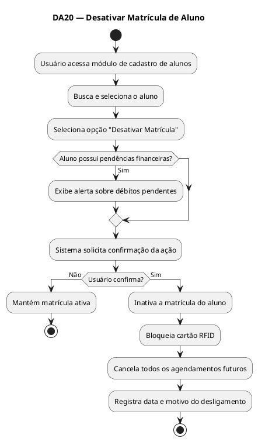