# FitPass Gym Management
# Documentação Completa — Casos de Uso e Diagramas de Atividade

> **Dupla:** José Elias Pires Junior (24001702) e André Ricardo Monteiro Rocha (24001777)
> **Disciplina:** Engenharia de Software | **Professor:** Marcelo Marud | **UNIFEOB — 2026**

---

## Índice

| # | Caso de Uso | Ator Principal |
|---|---|---|
| UC01 | [Realizar Login](#uc01--realizar-login) | Usuário |
| UC02 | [Cadastrar Novo Aluno](#uc02--cadastrar-novo-aluno) | Recepcionista |
| UC03 | [Criar Novo Plano de Academia](#uc03--criar-novo-plano-de-academia) | Gerente |
| UC04 | [Editar Plano Existente](#uc04--editar-plano-existente) | Gerente |
| UC05 | [Registrar Pagamento Presencial](#uc05--registrar-pagamento-presencial) | Recepcionista |
| UC06 | [Gerar Boleto para Pagamento Online](#uc06--gerar-boleto-para-pagamento-online) | Recepcionista |
| UC07 | [Verificar Regularidade do Aluno](#uc07--verificar-regularidade-do-aluno-automático) | Sistema |
| UC08 | [Validar Acesso na Catraca](#uc08--validar-acesso-na-catraca) | Catraca (API) |
| UC09 | [Consultar Grade de Aulas](#uc09--consultar-grade-de-aulas) | Aluno |
| UC10 | [Agendar Aula Coletiva](#uc10--agendar-aula-coletiva) | Aluno |
| UC11 | [Cancelar Reserva de Aula](#uc11--cancelar-reserva-de-aula) | Aluno |
| UC12 | [Registrar Presença em Aula](#uc12--registrar-presença-em-aula) | Instrutor |
| UC13 | [Registrar Avaliação Física](#uc13--registrar-avaliação-física) | Instrutor |
| UC14 | [Anexar Arquivos à Avaliação Física](#uc14--anexar-arquivos-à-avaliação-física) | Instrutor |
| UC15 | [Gerar Relatório de Inadimplência](#uc15--gerar-relatório-de-inadimplência) | Gerente |
| UC16 | [Gerar Relatório de Alunos Ativos](#uc16--gerar-relatório-de-alunos-ativos) | Gerente |
| UC17 | [Gerar Relatório de Ocupação de Aulas](#uc17--gerar-relatório-de-ocupação-de-aulas) | Gerente |
| UC18 | [Consultar Histórico de Acessos](#uc18--consultar-histórico-de-acessos) | Gerente |
| UC19 | [Notificar Vencimento de Mensalidade](#uc19--notificar-vencimento-de-mensalidade) | Sistema |
| UC20 | [Notificar Confirmação de Agendamento](#uc20--notificar-confirmação-de-agendamento) | Sistema |

---

## Diagrama de Casos de Uso

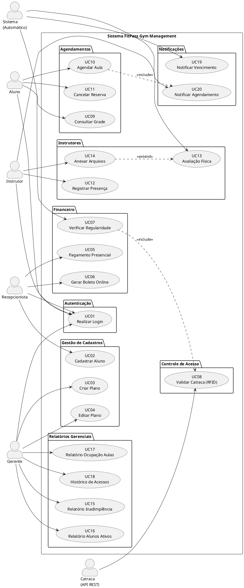
```plantuml
@startuml FitPass_DiagramaUso

skinparam actorStyle awesome
left to right direction

actor Aluno as AL
actor Recepcionista as RE
actor Instrutor as IN
actor Gerente as GE
actor "Sistema\n(Automático)" as SI
actor "Catraca\n(API REST)" as CA

rectangle "Sistema FitPass Gym Management" {

  package "Autenticação" {
    usecase "UC01\nRealizar Login" as UC01
  }

  package "Gestão de Cadastros" {
    usecase "UC02\nCadastrar Aluno" as UC02
    usecase "UC03\nCriar Plano" as UC03
    usecase "UC04\nEditar Plano" as UC04
  }

  package "Financeiro" {
    usecase "UC05\nPagamento Presencial" as UC05
    usecase "UC06\nGerar Boleto Online" as UC06
    usecase "UC07\nVerificar Regularidade" as UC07
  }

  package "Controle de Acesso" {
    usecase "UC08\nValidar Catraca (RFID)" as UC08
  }

  package "Agendamentos" {
    usecase "UC09\nConsultar Grade" as UC09
    usecase "UC10\nAgendar Aula" as UC10
    usecase "UC11\nCancelar Reserva" as UC11
  }

  package "Instrutores" {
    usecase "UC12\nRegistrar Presença" as UC12
    usecase "UC13\nAvaliação Física" as UC13
    usecase "UC14\nAnexar Arquivos" as UC14
  }

  package "Relatórios Gerenciais" {
    usecase "UC15\nRelatório Inadimplência" as UC15
    usecase "UC16\nRelatório Alunos Ativos" as UC16
    usecase "UC17\nRelatório Ocupação Aulas" as UC17
    usecase "UC18\nHistórico de Acessos" as UC18
  }

  package "Notificações" {
    usecase "UC19\nNotificar Vencimento" as UC19
    usecase "UC20\nNotificar Agendamento" as UC20
  }
}

AL --> UC01
AL --> UC09
AL --> UC10
AL --> UC11

RE --> UC01
RE --> UC02
RE --> UC05
RE --> UC06

IN --> UC01
IN --> UC12
IN --> UC13
IN --> UC14

GE --> UC01
GE --> UC03
GE --> UC04
GE --> UC15
GE --> UC16
GE --> UC17
GE --> UC18

SI --> UC07
SI --> UC19
SI --> UC20

CA --> UC08

UC10 ..> UC20 : <<include>>
UC07 ..> UC08 : <<include>>
UC14 ..> UC13 : <<extend>>

@enduml
```

---

## UC01 — Realizar Login

### Especificação

| Atributo | Descrição |
|---|---|
| **Identificador** | UC01 |
| **Nome** | Realizar Login |
| **Ator Principal** | Usuário (Aluno, Recepcionista, Instrutor, Gerente) |
| **Objetivo** | Autenticar o usuário e iniciar uma sessão segura no sistema. |
| **Pré-condições** | Usuário cadastrado e ativo no sistema. |
| **Pós-condições** | Sessão iniciada; usuário redirecionado ao painel do seu perfil. |
| **RF Relacionados** | RF01, RF09 |
| **RNF Relacionados** | RNF02 — Segurança / RNF03 — Tempo de Resposta |
| **RN Relacionadas** | RN06 |

**Fluxo Principal:**
1. O usuário informa e-mail e senha na tela de login.
2. O sistema valida as credenciais no banco de dados.
3. O sistema autentica e redireciona ao painel do perfil correspondente.

**Fluxos Alternativos:**
- **A1:** Credenciais inválidas → sistema exibe erro genérico e permite nova tentativa.
- **A2:** Conta bloqueada → sistema impede o acesso e exibe instrução de recuperação por e-mail.

### Diagrama de Atividade

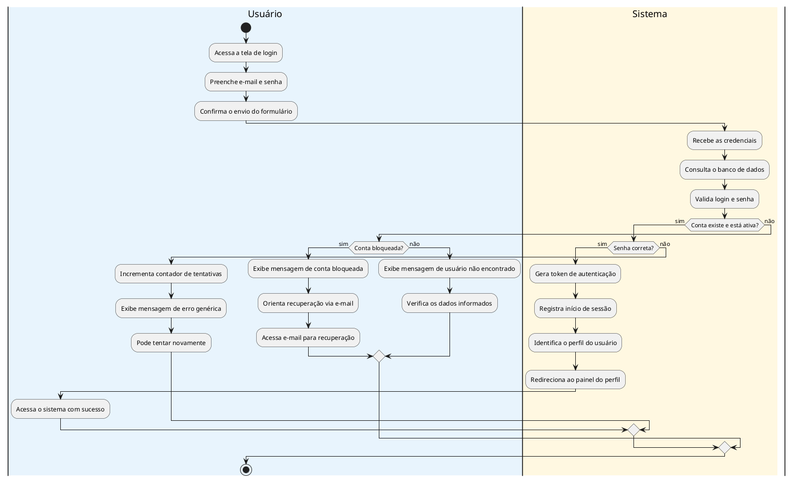
```plantuml
@startuml DA_UC01_Login
skinparam swimlaneWidth 200

|#E8F4FD|Usuário|
start
:Acessa a tela de login;
:Preenche e-mail e senha;
:Confirma o envio do formulário;

|#FFF8E1|Sistema|
:Recebe as credenciais;
:Consulta o banco de dados;
:Valida login e senha;

if (Conta existe e está ativa?) then (sim)
  if (Senha correta?) then (sim)
    :Gera token de autenticação;
    :Registra início de sessão;
    :Identifica o perfil do usuário;
    :Redireciona ao painel do perfil;
    |#E8F4FD|Usuário|
    :Acessa o sistema com sucesso;
  else (não)
    :Incrementa contador de tentativas;
    :Exibe mensagem de erro genérica;
    |#E8F4FD|Usuário|
    :Pode tentar novamente;
  endif
else (não)
  if (Conta bloqueada?) then (sim)
    :Exibe mensagem de conta bloqueada;
    :Orienta recuperação via e-mail;
    |#E8F4FD|Usuário|
    :Acessa e-mail para recuperação;
  else (não)
    :Exibe mensagem de usuário não encontrado;
    |#E8F4FD|Usuário|
    :Verifica os dados informados;
  endif
endif

stop
@enduml
```

---

## UC02 — Cadastrar Novo Aluno

### Especificação

| Atributo | Descrição |
|---|---|
| **Identificador** | UC02 |
| **Nome** | Cadastrar Novo Aluno |
| **Ator Principal** | Recepcionista |
| **Objetivo** | Registrar um novo aluno com todos os dados necessários para sua matrícula. |
| **Pré-condições** | Recepcionista autenticado no sistema. |
| **Pós-condições** | Aluno registrado; plano inicial vinculado ao cadastro. |
| **RF Relacionados** | RF01 |
| **RNF Relacionados** | RNF02 — Segurança / RNF04 — Usabilidade |
| **RN Relacionadas** | RN06 |

**Fluxo Principal:**
1. Recepcionista acessa o módulo de matrículas.
2. Sistema solicita: Nome, CPF, Endereço, Contato e Plano.
3. Recepcionista preenche e envia o formulário.
4. Sistema valida, verifica duplicidade e salva o registro.

**Fluxos Alternativos:**
- **A1:** CPF já cadastrado → sistema bloqueia e exibe alerta de duplicidade.

### Diagrama de Atividade

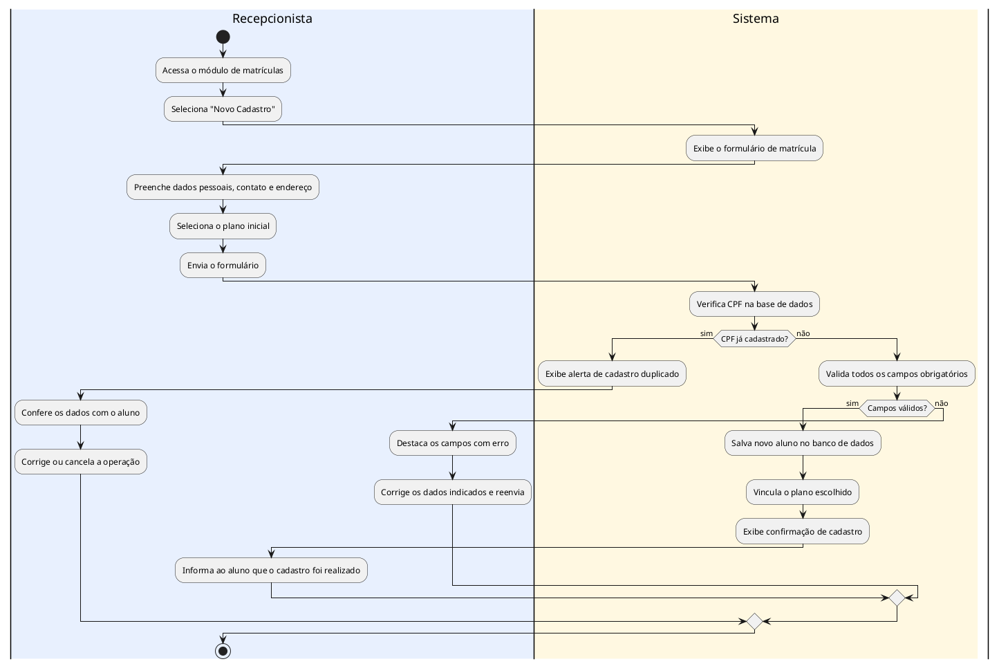
```plantuml
@startuml DA_UC02_CadastrarAluno
skinparam swimlaneWidth 200

|#E8F0FE|Recepcionista|
start
:Acessa o módulo de matrículas;
:Seleciona "Novo Cadastro";

|#FFF8E1|Sistema|
:Exibe o formulário de matrícula;

|#E8F0FE|Recepcionista|
:Preenche dados pessoais, contato e endereço;
:Seleciona o plano inicial;
:Envia o formulário;

|#FFF8E1|Sistema|
:Verifica CPF na base de dados;

if (CPF já cadastrado?) then (sim)
  :Exibe alerta de cadastro duplicado;
  |#E8F0FE|Recepcionista|
  :Confere os dados com o aluno;
  :Corrige ou cancela a operação;
else (não)
  |#FFF8E1|Sistema|
  :Valida todos os campos obrigatórios;
  if (Campos válidos?) then (sim)
    :Salva novo aluno no banco de dados;
    :Vincula o plano escolhido;
    :Exibe confirmação de cadastro;
    |#E8F0FE|Recepcionista|
    :Informa ao aluno que o cadastro foi realizado;
  else (não)
    :Destaca os campos com erro;
    |#E8F0FE|Recepcionista|
    :Corrige os dados indicados e reenvia;
  endif
endif

stop
@enduml
```

---

## UC03 — Criar Novo Plano de Academia

### Especificação

| Atributo | Descrição |
|---|---|
| **Identificador** | UC03 |
| **Nome** | Criar Novo Plano de Academia |
| **Ator Principal** | Gerente |
| **Objetivo** | Cadastrar novas modalidades de planos disponíveis para venda. |
| **Pré-condições** | Gerente autenticado no sistema. |
| **Pós-condições** | Plano disponível para seleção nas matrículas. |
| **RF Relacionados** | RF02 |
| **RNF Relacionados** | RNF05 — Escalabilidade |
| **RN Relacionadas** | RN06 |

**Fluxo Principal:**
1. Gerente acessa "Configurações de Planos" e seleciona novo plano.
2. Gerente define nome, valor, duração e modalidades incluídas.
3. Sistema valida e disponibiliza o plano.

**Fluxos Alternativos:**
- **A1:** Valor inválido (zero ou negativo) → sistema solicita correção.

### Diagrama de Atividade

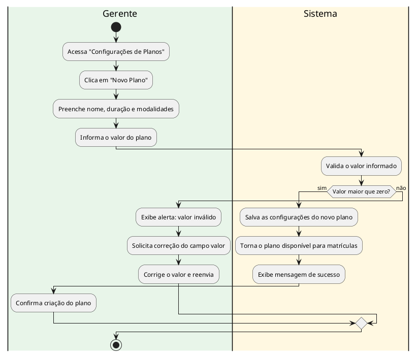
```plantuml
@startuml DA_UC03_CriarPlano

|#E8F5E9|Gerente|
start
:Acessa "Configurações de Planos";
:Clica em "Novo Plano";
:Preenche nome, duração e modalidades;
:Informa o valor do plano;

|#FFF8E1|Sistema|
:Valida o valor informado;

if (Valor maior que zero?) then (sim)
  :Salva as configurações do novo plano;
  :Torna o plano disponível para matrículas;
  :Exibe mensagem de sucesso;
  |#E8F5E9|Gerente|
  :Confirma criação do plano;
else (não)
  :Exibe alerta: valor inválido;
  :Solicita correção do campo valor;
  |#E8F5E9|Gerente|
  :Corrige o valor e reenvia;
endif

stop
@enduml
```

---

## UC04 — Editar Plano Existente

### Especificação

| Atributo | Descrição |
|---|---|
| **Identificador** | UC04 |
| **Nome** | Editar Plano Existente |
| **Ator Principal** | Gerente |
| **Objetivo** | Alterar valores ou condições de um plano já cadastrado. |
| **Pré-condições** | Plano cadastrado no sistema. |
| **Pós-condições** | Dados do plano atualizados para novas adesões. |
| **RF Relacionados** | RF02 |
| **RNF Relacionados** | RNF01 — Disponibilidade |
| **RN Relacionadas** | RN06 |

**Fluxo Principal:**
1. Gerente busca e seleciona o plano desejado.
2. Sistema exibe os dados atuais.
3. Gerente edita e salva as alterações.

**Fluxos Alternativos:**
- **A1:** Plano com alunos vinculados → sistema avisa que mudanças valem apenas para novas adesões.

### Diagrama de Atividade

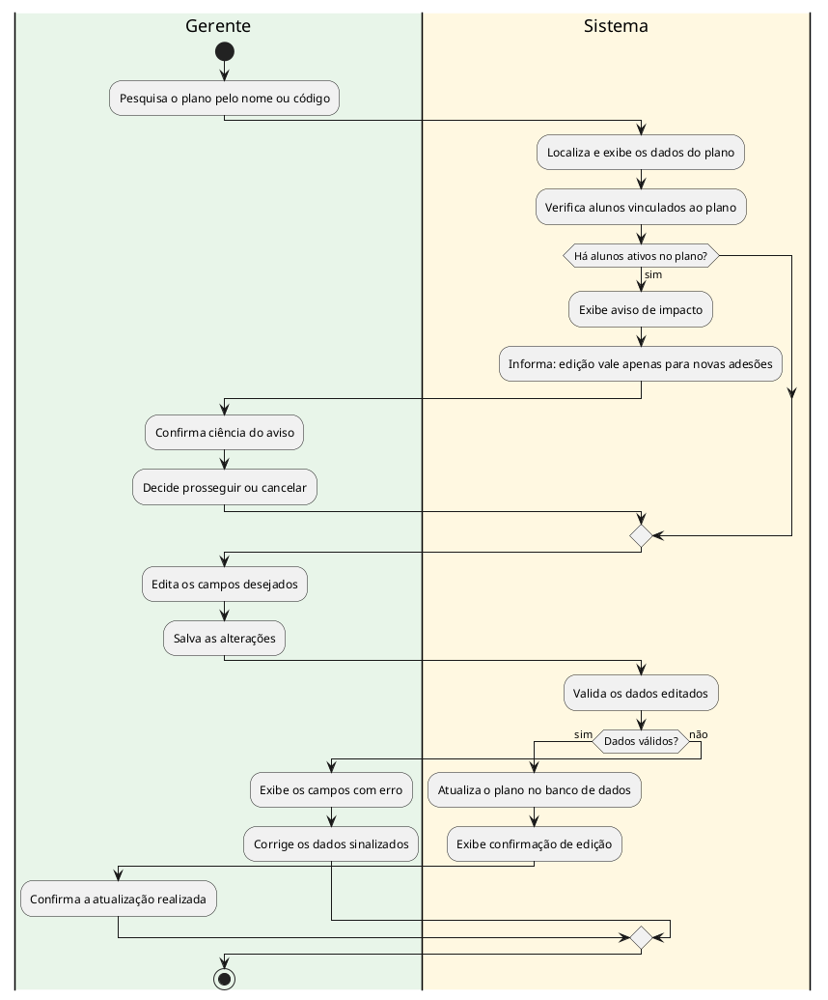
```plantuml
@startuml DA_UC04_EditarPlano

|#E8F5E9|Gerente|
start
:Pesquisa o plano pelo nome ou código;

|#FFF8E1|Sistema|
:Localiza e exibe os dados do plano;
:Verifica alunos vinculados ao plano;

if (Há alunos ativos no plano?) then (sim)
  :Exibe aviso de impacto;
  :Informa: edição vale apenas para novas adesões;
  |#E8F5E9|Gerente|
  :Confirma ciência do aviso;
  :Decide prosseguir ou cancelar;
endif

|#E8F5E9|Gerente|
:Edita os campos desejados;
:Salva as alterações;

|#FFF8E1|Sistema|
:Valida os dados editados;

if (Dados válidos?) then (sim)
  :Atualiza o plano no banco de dados;
  :Exibe confirmação de edição;
  |#E8F5E9|Gerente|
  :Confirma a atualização realizada;
else (não)
  :Exibe os campos com erro;
  |#E8F5E9|Gerente|
  :Corrige os dados sinalizados;
endif

stop
@enduml
```

---

## UC05 — Registrar Pagamento Presencial

### Especificação

| Atributo | Descrição |
|---|---|
| **Identificador** | UC05 |
| **Nome** | Registrar Pagamento Presencial |
| **Ator Principal** | Recepcionista |
| **Objetivo** | Registrar a quitação de mensalidade realizada presencialmente na recepção. |
| **Pré-condições** | Aluno com débito pendente selecionado no sistema. |
| **Pós-condições** | Pagamento registrado; status do aluno atualizado imediatamente (RN07). |
| **RF Relacionados** | RF03, RF04 |
| **RNF Relacionados** | RNF03 — Tempo de Resposta |
| **RN Relacionadas** | RN04, RN06, RN07 |

**Fluxo Principal:**
1. Recepcionista seleciona aluno e parcela em aberto.
2. Sistema solicita forma de pagamento (Dinheiro, Cartão ou PIX).
3. Recepcionista confirma recebimento do valor integral.
4. Sistema registra, gera comprovante e atualiza status imediatamente.

**Fluxos Alternativos:**
- **A1:** Valor parcial → sistema bloqueia e informa que pagamento parcial não é permitido (RN04).

### Diagrama de Atividade

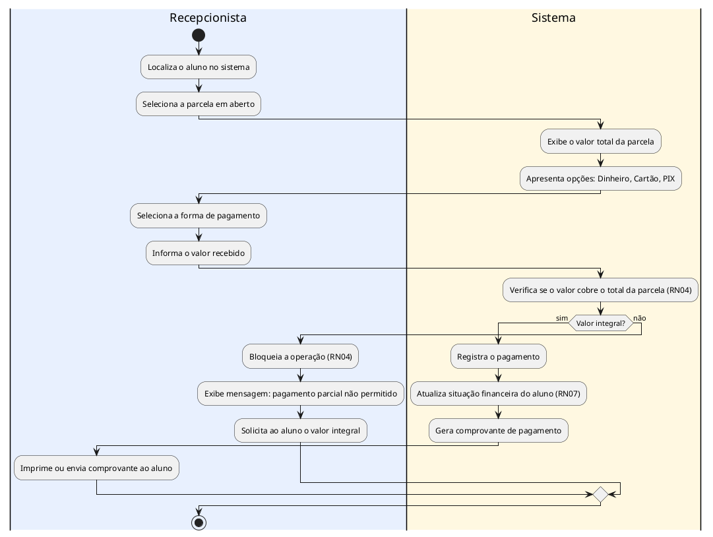
```plantuml
@startuml DA_UC05_PagamentoPresencial

|#E8F0FE|Recepcionista|
start
:Localiza o aluno no sistema;
:Seleciona a parcela em aberto;

|#FFF8E1|Sistema|
:Exibe o valor total da parcela;
:Apresenta opções: Dinheiro, Cartão, PIX;

|#E8F0FE|Recepcionista|
:Seleciona a forma de pagamento;
:Informa o valor recebido;

|#FFF8E1|Sistema|
:Verifica se o valor cobre o total da parcela (RN04);

if (Valor integral?) then (sim)
  :Registra o pagamento;
  :Atualiza situação financeira do aluno (RN07);
  :Gera comprovante de pagamento;
  |#E8F0FE|Recepcionista|
  :Imprime ou envia comprovante ao aluno;
else (não)
  :Bloqueia a operação (RN04);
  :Exibe mensagem: pagamento parcial não permitido;
  |#E8F0FE|Recepcionista|
  :Solicita ao aluno o valor integral;
endif

stop
@enduml
```

---

## UC06 — Gerar Boleto para Pagamento Online

### Especificação

| Atributo | Descrição |
|---|---|
| **Identificador** | UC06 |
| **Nome** | Gerar Boleto para Pagamento Online |
| **Ator Principal** | Recepcionista |
| **Objetivo** | Emitir cobrança para que o aluno realize o pagamento remotamente. |
| **Pré-condições** | Integração com API bancária ativa. |
| **Pós-condições** | Boleto disponível no perfil do aluno. |
| **RF Relacionados** | RF03 |
| **RNF Relacionados** | RNF06 — Integração |
| **RN Relacionadas** | RN06 |

**Fluxo Principal:**
1. Recepcionista solicita emissão de boleto para o aluno selecionado.
2. Sistema comunica-se com a API bancária.
3. Link do boleto é salvo no perfil do aluno.

**Fluxos Alternativos:**
- **A1:** API indisponível → sistema exibe aviso e sugere nova tentativa.

### Diagrama de Atividade

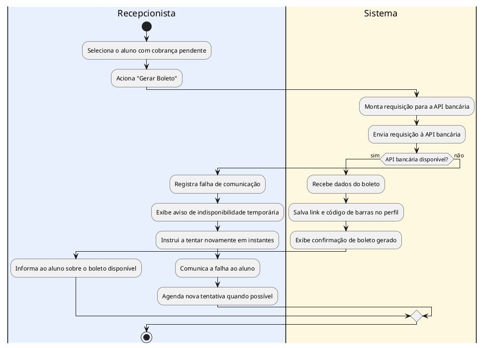
```plantuml
@startuml DA_UC06_GerarBoleto

|#E8F0FE|Recepcionista|
start
:Seleciona o aluno com cobrança pendente;
:Aciona "Gerar Boleto";

|#FFF8E1|Sistema|
:Monta requisição para a API bancária;
:Envia requisição à API bancária;

if (API bancária disponível?) then (sim)
  :Recebe dados do boleto;
  :Salva link e código de barras no perfil;
  :Exibe confirmação de boleto gerado;
  |#E8F0FE|Recepcionista|
  :Informa ao aluno sobre o boleto disponível;
else (não)
  :Registra falha de comunicação;
  :Exibe aviso de indisponibilidade temporária;
  :Instrui a tentar novamente em instantes;
  |#E8F0FE|Recepcionista|
  :Comunica a falha ao aluno;
  :Agenda nova tentativa quando possível;
endif

stop
@enduml
```

---

## UC07 — Verificar Regularidade do Aluno (Automático)

### Especificação

| Atributo | Descrição |
|---|---|
| **Identificador** | UC07 |
| **Nome** | Verificar Regularidade do Aluno |
| **Ator Principal** | Sistema (rotina automática) |
| **Objetivo** | Monitorar diariamente a situação financeira de todos os alunos cadastrados. |
| **Pré-condições** | Rotina agendada configurada no servidor. |
| **Pós-condições** | Status de cada aluno atualizado como "Regular" ou "Inadimplente". |
| **RF Relacionados** | RF04 |
| **RNF Relacionados** | RNF01 — Disponibilidade |
| **RN Relacionadas** | RN01, RN07 |

**Fluxo Principal:**
1. Sistema verifica datas de vencimento de todas as parcelas.
2. Calcula os dias de atraso para cada débito pendente.
3. Se atraso > 5 dias, marca o aluno para bloqueio de acesso (RN01).

**Fluxos Alternativos:**
- **A1:** Pagamento recém-quitado → sistema restaura regularidade imediatamente (RN07).

### Diagrama de Atividade

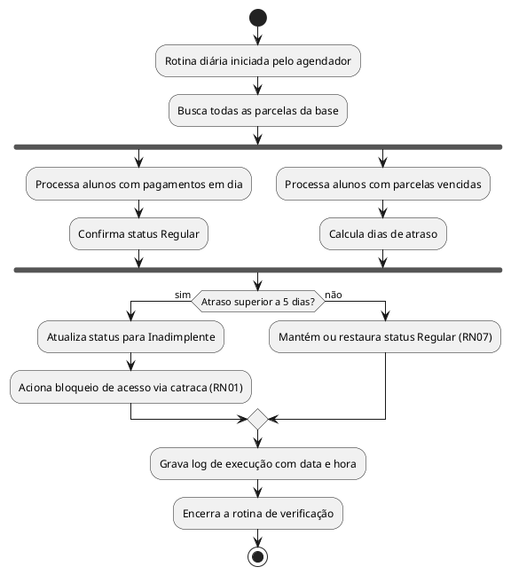
```plantuml
@startuml DA_UC07_VerificarRegularidade

|#FFF8E1|Sistema|
start
:Rotina diária iniciada pelo agendador;
:Busca todas as parcelas da base;

fork
  :Processa alunos com pagamentos em dia;
  :Confirma status Regular;
fork again
  :Processa alunos com parcelas vencidas;
  :Calcula dias de atraso;
end fork

if (Atraso superior a 5 dias?) then (sim)
  :Atualiza status para Inadimplente;
  :Aciona bloqueio de acesso via catraca (RN01);
else (não)
  :Mantém ou restaura status Regular (RN07);
endif

:Grava log de execução com data e hora;
:Encerra a rotina de verificação;
stop
@enduml
```

---

## UC08 — Validar Acesso na Catraca

### Especificação

| Atributo | Descrição |
|---|---|
| **Identificador** | UC08 |
| **Nome** | Validar Acesso na Catraca |
| **Ator Principal** | Sistema de Catraca (API REST) |
| **Objetivo** | Liberar ou bloquear a entrada física do aluno por RFID. |
| **Pré-condições** | Aluno posiciona tag RFID no leitor. |
| **Pós-condições** | Entrada registrada ou bloqueio exibido. |
| **RF Relacionados** | RF04, RF05 |
| **RNF Relacionados** | RNF03 — Tempo de Resposta (≤ 3s) / RNF06 — Integração API REST/JSON |
| **RN Relacionadas** | RN01 |

**Fluxo Principal:**
1. Aluno aproxima RFID do leitor.
2. Catraca envia ID ao servidor FitPass via API REST/JSON.
3. Sistema verifica regularidade e retorna sinal de liberação ou bloqueio.

**Fluxos Alternativos:**
- **A1:** Inadimplência > 5 dias → nega acesso e orienta à recepção.
- **A2:** RFID não reconhecido → retorna credencial inválida.

### Diagrama de Atividade

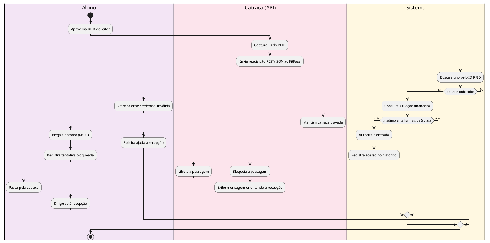
```plantuml
@startuml DA_UC08_ValidarCatraca

|#F3E5F5|Aluno|
start
:Aproxima RFID do leitor;

|#FCE4EC|Catraca (API)|
:Captura ID do RFID;
:Envia requisição REST/JSON ao FitPass;

|#FFF8E1|Sistema|
:Busca aluno pelo ID RFID;

if (RFID reconhecido?) then (sim)
  :Consulta situação financeira;
  if (Inadimplente há mais de 5 dias?) then (não)
    :Autoriza a entrada;
    :Registra acesso no histórico;
    |#FCE4EC|Catraca (API)|
    :Libera a passagem;
    |#F3E5F5|Aluno|
    :Passa pela catraca;
  else (sim)
    :Nega a entrada (RN01);
    :Registra tentativa bloqueada;
    |#FCE4EC|Catraca (API)|
    :Bloqueia a passagem;
    :Exibe mensagem orientando à recepção;
    |#F3E5F5|Aluno|
    :Dirige-se à recepção;
  endif
else (não)
  :Retorna erro: credencial inválida;
  |#FCE4EC|Catraca (API)|
  :Mantém catraca travada;
  |#F3E5F5|Aluno|
  :Solicita ajuda à recepção;
endif

stop
@enduml
```

---

## UC09 — Consultar Grade de Aulas

### Especificação

| Atributo | Descrição |
|---|---|
| **Identificador** | UC09 |
| **Nome** | Consultar Grade de Aulas |
| **Ator Principal** | Aluno |
| **Objetivo** | Exibir horários, modalidades e vagas disponíveis nas aulas. |
| **Pré-condições** | Aluno autenticado no aplicativo ou portal. |
| **Pós-condições** | Grade de aulas exibida para o aluno. |
| **RF Relacionados** | RF06 |
| **RNF Relacionados** | RNF04 — Usabilidade |
| **RN Relacionadas** | — |

**Fluxo Principal:**
1. Aluno acessa o módulo de Agendamentos.
2. Sistema exibe aulas com horários, instrutores e vagas.

**Fluxos Alternativos:**
- **A1:** Nenhuma aula cadastrada → sistema informa indisponibilidade para a data.

### Diagrama de Atividade

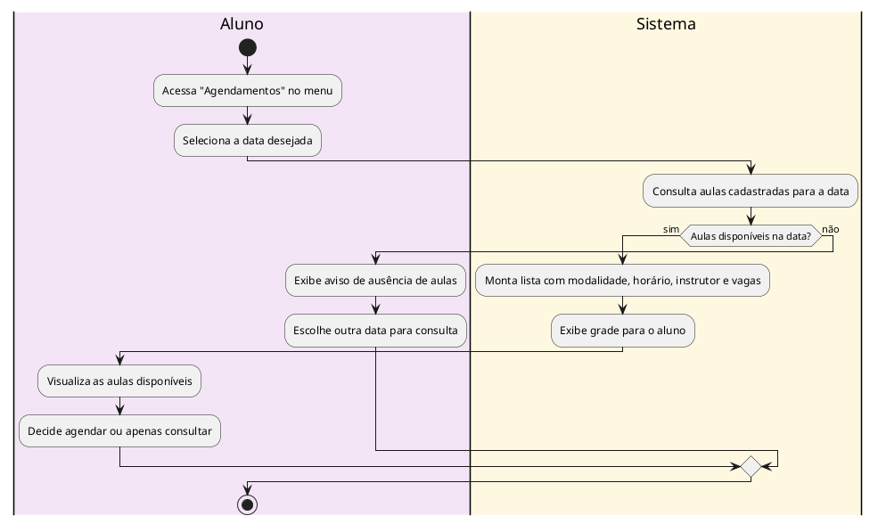
```plantuml
@startuml DA_UC09_ConsultarGrade

|#F3E5F5|Aluno|
start
:Acessa "Agendamentos" no menu;
:Seleciona a data desejada;

|#FFF8E1|Sistema|
:Consulta aulas cadastradas para a data;

if (Aulas disponíveis na data?) then (sim)
  :Monta lista com modalidade, horário, instrutor e vagas;
  :Exibe grade para o aluno;
  |#F3E5F5|Aluno|
  :Visualiza as aulas disponíveis;
  :Decide agendar ou apenas consultar;
else (não)
  :Exibe aviso de ausência de aulas;
  |#F3E5F5|Aluno|
  :Escolhe outra data para consulta;
endif

stop
@enduml
```

---

## UC10 — Agendar Aula Coletiva

### Especificação

| Atributo | Descrição |
|---|---|
| **Identificador** | UC10 |
| **Nome** | Agendar Aula Coletiva |
| **Ator Principal** | Aluno |
| **Objetivo** | Reservar uma vaga em uma aula coletiva disponível. |
| **Pré-condições** | Aluno regular e vaga disponível na aula. |
| **Pós-condições** | Reserva confirmada; vaga decrementada; notificação enviada (UC20). |
| **RF Relacionados** | RF06, RF10 |
| **RNF Relacionados** | RNF04 — Usabilidade |
| **RN Relacionadas** | RN01, RN02 |

**Fluxo Principal:**
1. Aluno seleciona aula e solicita reserva.
2. Sistema verifica situação financeira e disponibilidade de vagas.
3. Reserva confirmada e notificação disparada (UC20).

**Fluxos Alternativos:**
- **A1:** Aula lotada → sistema bloqueia e informa (RN02).
- **A2:** Aluno inadimplente → sistema impede agendamento (RN01).

### Diagrama de Atividade

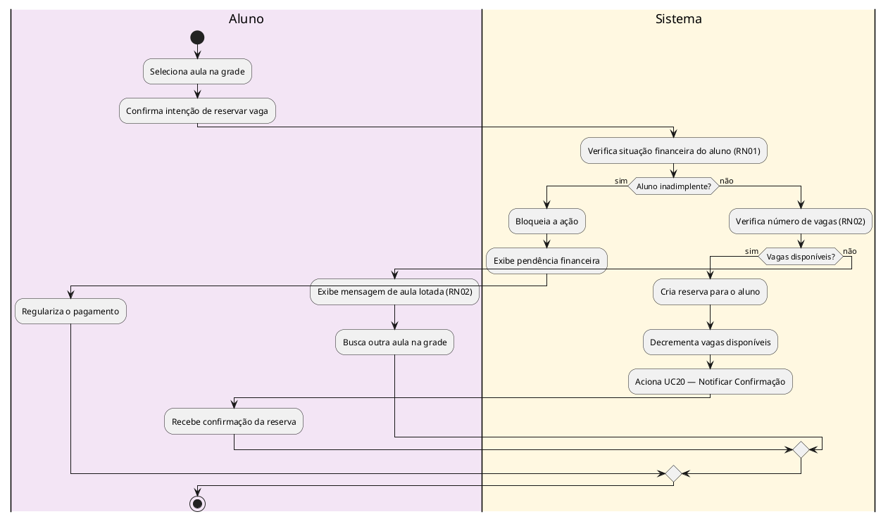
```plantuml
@startuml DA_UC10_AgendarAula

|#F3E5F5|Aluno|
start
:Seleciona aula na grade;
:Confirma intenção de reservar vaga;

|#FFF8E1|Sistema|
:Verifica situação financeira do aluno (RN01);

if (Aluno inadimplente?) then (sim)
  :Bloqueia a ação;
  :Exibe pendência financeira;
  |#F3E5F5|Aluno|
  :Regulariza o pagamento;
else (não)
  |#FFF8E1|Sistema|
  :Verifica número de vagas (RN02);
  if (Vagas disponíveis?) then (sim)
    :Cria reserva para o aluno;
    :Decrementa vagas disponíveis;
    :Aciona UC20 — Notificar Confirmação;
    |#F3E5F5|Aluno|
    :Recebe confirmação da reserva;
  else (não)
    :Exibe mensagem de aula lotada (RN02);
    |#F3E5F5|Aluno|
    :Busca outra aula na grade;
  endif
endif

stop
@enduml
```

---

## UC11 — Cancelar Reserva de Aula

### Especificação

| Atributo | Descrição |
|---|---|
| **Identificador** | UC11 |
| **Nome** | Cancelar Reserva de Aula |
| **Ator Principal** | Aluno |
| **Objetivo** | Liberar a vaga de uma aula previamente reservada. |
| **Pré-condições** | Reserva ativa registrada no sistema. |
| **Pós-condições** | Vaga devolvida ao pool disponível. |
| **RF Relacionados** | RF06 |
| **RNF Relacionados** | RNF04 — Usabilidade |
| **RN Relacionadas** | RN02, RN03 |

**Fluxo Principal:**
1. Aluno acessa seus agendamentos e seleciona cancelamento.
2. Sistema verifica se falta mais de 1 hora para a aula (RN03).
3. Cancelamento confirmado e vaga liberada.

**Fluxos Alternativos:**
- **A1:** Menos de 1 hora para a aula → sistema bloqueia o cancelamento (RN03).

### Diagrama de Atividade

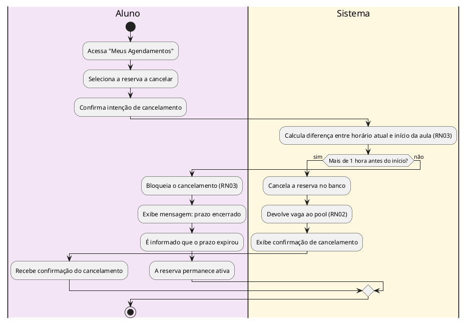
```plantuml
@startuml DA_UC11_CancelarReserva

|#F3E5F5|Aluno|
start
:Acessa "Meus Agendamentos";
:Seleciona a reserva a cancelar;
:Confirma intenção de cancelamento;

|#FFF8E1|Sistema|
:Calcula diferença entre horário atual e início da aula (RN03);

if (Mais de 1 hora antes do início?) then (sim)
  :Cancela a reserva no banco;
  :Devolve vaga ao pool (RN02);
  :Exibe confirmação de cancelamento;
  |#F3E5F5|Aluno|
  :Recebe confirmação do cancelamento;
else (não)
  :Bloqueia o cancelamento (RN03);
  :Exibe mensagem: prazo encerrado;
  |#F3E5F5|Aluno|
  :É informado que o prazo expirou;
  :A reserva permanece ativa;
endif

stop
@enduml
```

---

## UC12 — Registrar Presença em Aula

### Especificação

| Atributo | Descrição |
|---|---|
| **Identificador** | UC12 |
| **Nome** | Registrar Presença em Aula |
| **Ator Principal** | Instrutor |
| **Objetivo** | Confirmar quais alunos participaram da aula. |
| **Pré-condições** | Aula em andamento ou recém-finalizada. |
| **Pós-condições** | Presenças salvas com data e hora no histórico de cada aluno. |
| **RF Relacionados** | RF07 |
| **RNF Relacionados** | RNF01 — Disponibilidade |
| **RN Relacionadas** | RN06 |

**Fluxo Principal:**
1. Instrutor acessa a aula no sistema.
2. Sistema exibe a lista de alunos com reserva.
3. Instrutor marca presentes e finaliza.

**Fluxos Alternativos:**
- **A1:** Aluno sem reserva presente → instrutor pode adicionar manualmente se houver vaga.

### Diagrama de Atividade

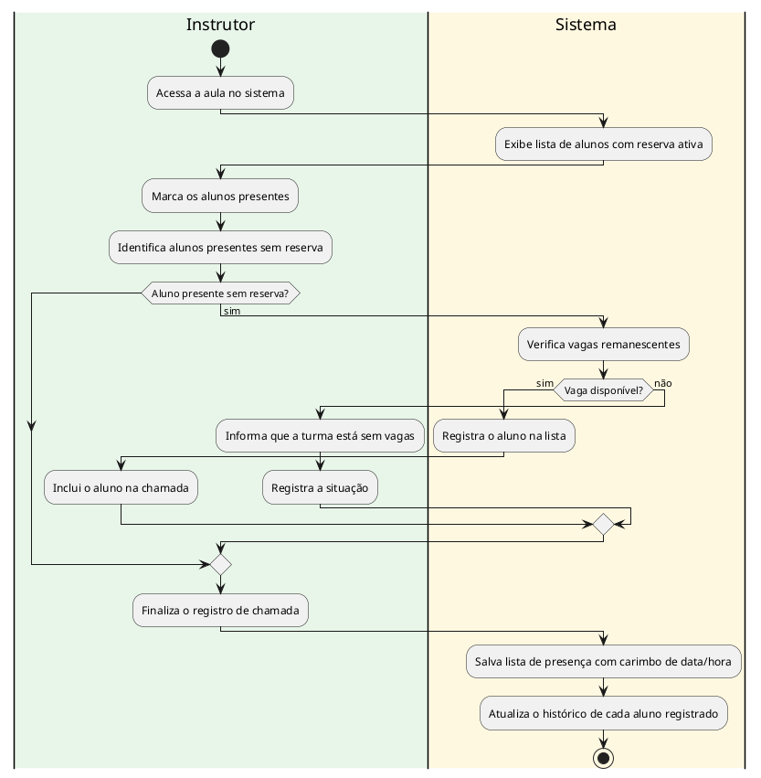
```plantuml
@startuml DA_UC12_RegistrarPresenca

|#E8F5E9|Instrutor|
start
:Acessa a aula no sistema;

|#FFF8E1|Sistema|
:Exibe lista de alunos com reserva ativa;

|#E8F5E9|Instrutor|
:Marca os alunos presentes;
:Identifica alunos presentes sem reserva;

if (Aluno presente sem reserva?) then (sim)
  |#FFF8E1|Sistema|
  :Verifica vagas remanescentes;
  if (Vaga disponível?) then (sim)
    :Registra o aluno na lista;
    |#E8F5E9|Instrutor|
    :Inclui o aluno na chamada;
  else (não)
    :Informa que a turma está sem vagas;
    |#E8F5E9|Instrutor|
    :Registra a situação;
  endif
endif

|#E8F5E9|Instrutor|
:Finaliza o registro de chamada;

|#FFF8E1|Sistema|
:Salva lista de presença com carimbo de data/hora;
:Atualiza o histórico de cada aluno registrado;

stop
@enduml
```

---

## UC13 — Registrar Avaliação Física

### Especificação

| Atributo | Descrição |
|---|---|
| **Identificador** | UC13 |
| **Nome** | Registrar Avaliação Física |
| **Ator Principal** | Instrutor |
| **Objetivo** | Cadastrar as métricas corporais do aluno para acompanhamento. |
| **Pré-condições** | Aluno ativo e regular (RN05). |
| **Pós-condições** | Avaliação salva no perfil do aluno; indicadores calculados. |
| **RF Relacionados** | RF08 |
| **RNF Relacionados** | RNF02 — Segurança / RNF04 — Usabilidade |
| **RN Relacionadas** | RN05, RN06 |

**Fluxo Principal:**
1. Instrutor seleciona aluno e inicia avaliação.
2. Sistema verifica elegibilidade (RN05).
3. Instrutor insere métricas; sistema calcula IMC e salva.

**Fluxos Alternativos:**
- **A1:** Aluno irregular → sistema bloqueia e exibe pendência (RN05).

### Diagrama de Atividade

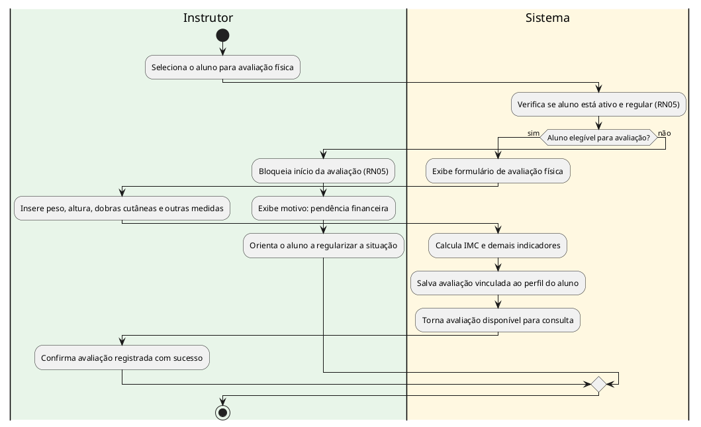
```plantuml
@startuml DA_UC13_AvaliacaoFisica

|#E8F5E9|Instrutor|
start
:Seleciona o aluno para avaliação física;

|#FFF8E1|Sistema|
:Verifica se aluno está ativo e regular (RN05);

if (Aluno elegível para avaliação?) then (sim)
  :Exibe formulário de avaliação física;
  |#E8F5E9|Instrutor|
  :Insere peso, altura, dobras cutâneas e outras medidas;
  |#FFF8E1|Sistema|
  :Calcula IMC e demais indicadores;
  :Salva avaliação vinculada ao perfil do aluno;
  :Torna avaliação disponível para consulta;
  |#E8F5E9|Instrutor|
  :Confirma avaliação registrada com sucesso;
else (não)
  :Bloqueia início da avaliação (RN05);
  :Exibe motivo: pendência financeira;
  |#E8F5E9|Instrutor|
  :Orienta o aluno a regularizar a situação;
endif

stop
@enduml
```

---

## UC14 — Anexar Arquivos à Avaliação Física

### Especificação

| Atributo | Descrição |
|---|---|
| **Identificador** | UC14 |
| **Nome** | Anexar Arquivos à Avaliação Física |
| **Ator Principal** | Instrutor |
| **Objetivo** | Vincular fotos ou laudos ao registro de avaliação do aluno. |
| **Pré-condições** | Avaliação física aberta para edição. |
| **Pós-condições** | Arquivos vinculados à avaliação e ao perfil do aluno. |
| **RF Relacionados** | RF08 |
| **RNF Relacionados** | RNF02 — Segurança |
| **RN Relacionadas** | RN06 |

**Fluxo Principal:**
1. Instrutor acessa a opção "Anexar Arquivos".
2. Seleciona imagens ou PDFs.
3. Sistema realiza upload e vincula à avaliação.

**Fluxos Alternativos:**
- **A1:** Arquivo acima do tamanho permitido → sistema rejeita e solicita arquivo menor.

### Diagrama de Atividade

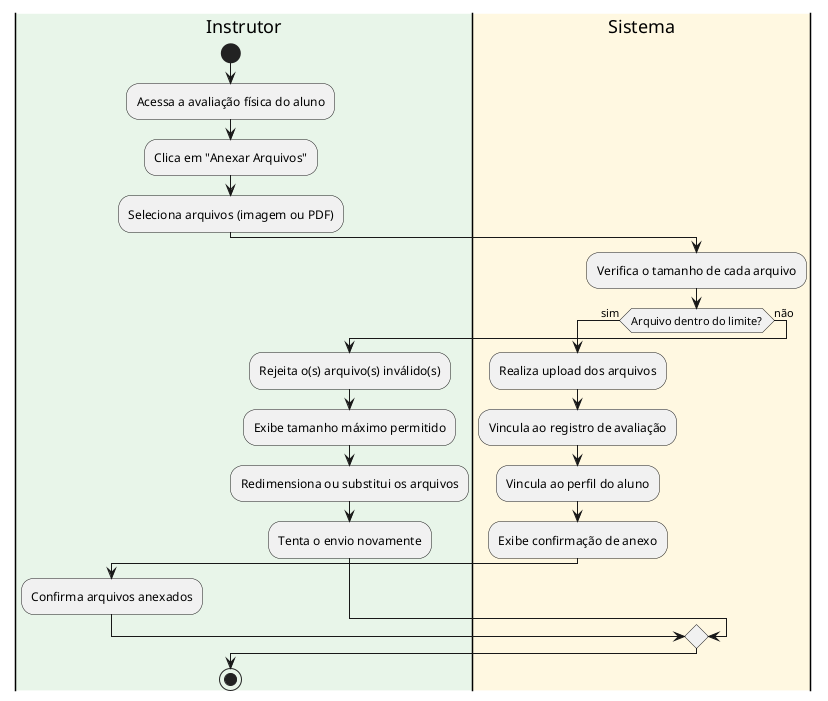
```plantuml
@startuml DA_UC14_AnexarArquivos

|#E8F5E9|Instrutor|
start
:Acessa a avaliação física do aluno;
:Clica em "Anexar Arquivos";
:Seleciona arquivos (imagem ou PDF);

|#FFF8E1|Sistema|
:Verifica o tamanho de cada arquivo;

if (Arquivo dentro do limite?) then (sim)
  :Realiza upload dos arquivos;
  :Vincula ao registro de avaliação;
  :Vincula ao perfil do aluno;
  :Exibe confirmação de anexo;
  |#E8F5E9|Instrutor|
  :Confirma arquivos anexados;
else (não)
  :Rejeita o(s) arquivo(s) inválido(s);
  :Exibe tamanho máximo permitido;
  |#E8F5E9|Instrutor|
  :Redimensiona ou substitui os arquivos;
  :Tenta o envio novamente;
endif

stop
@enduml
```

---

## UC15 — Gerar Relatório de Inadimplência

### Especificação

| Atributo | Descrição |
|---|---|
| **Identificador** | UC15 |
| **Nome** | Gerar Relatório de Inadimplência |
| **Ator Principal** | Gerente |
| **Objetivo** | Listar todos os alunos com pagamentos em atraso para tomada de decisão. |
| **Pré-condições** | Gerente autenticado com perfil gerencial. |
| **Pós-condições** | Relatório de inadimplentes exibido e disponível para exportação. |
| **RF Relacionados** | RF09 |
| **RNF Relacionados** | RNF01 — Disponibilidade / RNF05 — Escalabilidade |
| **RN Relacionadas** | RN01, RN06 |

**Fluxo Principal:**
1. Gerente solicita relatório no módulo de relatórios.
2. Sistema filtra pagamentos vencidos e não quitados.
3. Exibe tabela com nome, valor em aberto e dias de atraso.

**Fluxos Alternativos:**
- **A1:** Filtro por período → gerente define datas de início e fim.

### Diagrama de Atividade

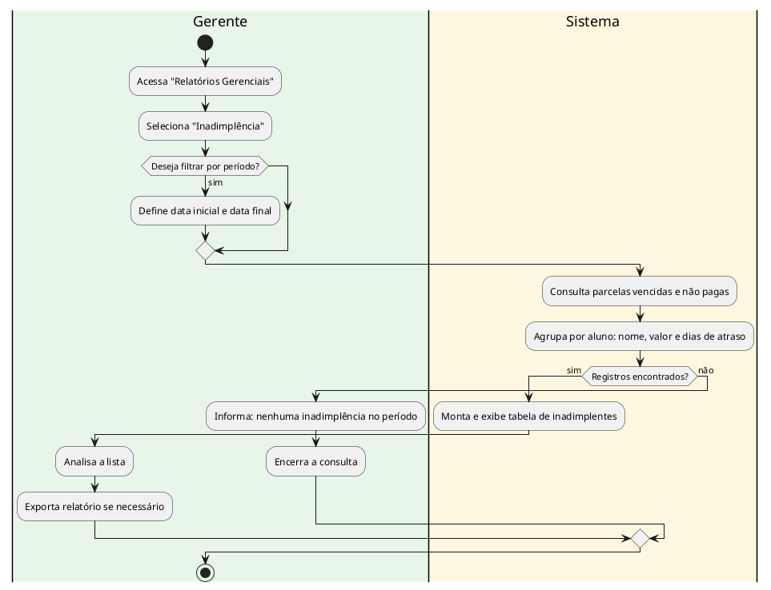
```plantuml
@startuml DA_UC15_RelatorioInadimplencia

|#E8F5E9|Gerente|
start
:Acessa "Relatórios Gerenciais";
:Seleciona "Inadimplência";

if (Deseja filtrar por período?) then (sim)
  :Define data inicial e data final;
endif

|#FFF8E1|Sistema|
:Consulta parcelas vencidas e não pagas;
:Agrupa por aluno: nome, valor e dias de atraso;

if (Registros encontrados?) then (sim)
  :Monta e exibe tabela de inadimplentes;
  |#E8F5E9|Gerente|
  :Analisa a lista;
  :Exporta relatório se necessário;
else (não)
  :Informa: nenhuma inadimplência no período;
  |#E8F5E9|Gerente|
  :Encerra a consulta;
endif

stop
@enduml
```

---

## UC16 — Gerar Relatório de Alunos Ativos

### Especificação

| Atributo | Descrição |
|---|---|
| **Identificador** | UC16 |
| **Nome** | Gerar Relatório de Alunos Ativos |
| **Ator Principal** | Gerente |
| **Objetivo** | Listar alunos com matrículas vigentes para análise de retenção. |
| **Pré-condições** | Gerente autenticado com permissão administrativa. |
| **Pós-condições** | Lista de alunos ativos gerada e exibida. |
| **RF Relacionados** | RF09 |
| **RNF Relacionados** | RNF01 — Disponibilidade / RNF05 — Escalabilidade |
| **RN Relacionadas** | RN06 |

**Fluxo Principal:**
1. Gerente acessa "Relatórios Gerenciais" e seleciona "Alunos Ativos".
2. Sistema consulta base e filtra alunos com planos ativos e situação regular.
3. Exibe lista com Nome, Plano, Expiração e Último Acesso.

**Fluxos Alternativos:**
- **A1:** Nenhum aluno ativo → sistema informa base vazia.

### Diagrama de Atividade

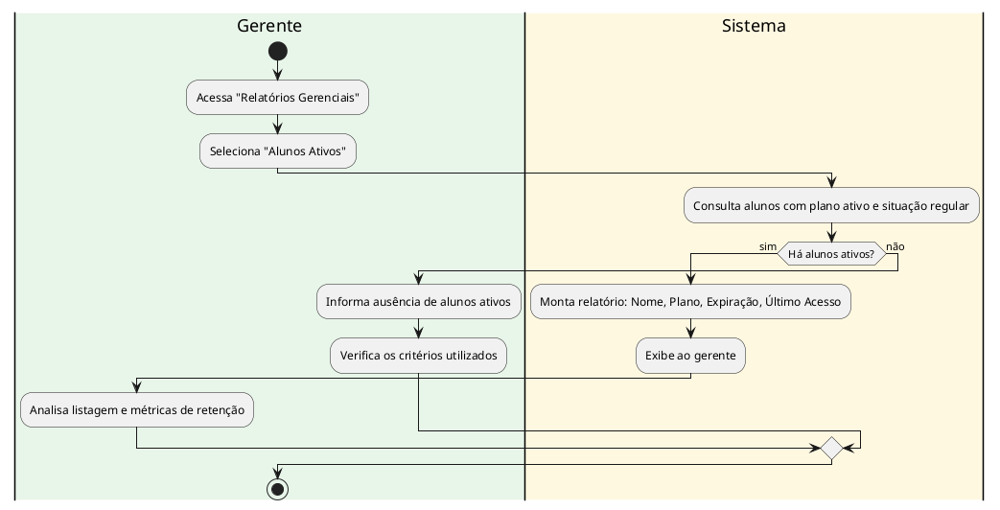
```plantuml
@startuml DA_UC16_AlunosAtivos

|#E8F5E9|Gerente|
start
:Acessa "Relatórios Gerenciais";
:Seleciona "Alunos Ativos";

|#FFF8E1|Sistema|
:Consulta alunos com plano ativo e situação regular;

if (Há alunos ativos?) then (sim)
  :Monta relatório: Nome, Plano, Expiração, Último Acesso;
  :Exibe ao gerente;
  |#E8F5E9|Gerente|
  :Analisa listagem e métricas de retenção;
else (não)
  :Informa ausência de alunos ativos;
  |#E8F5E9|Gerente|
  :Verifica os critérios utilizados;
endif

stop
@enduml
```

---

## UC17 — Gerar Relatório de Ocupação de Aulas

### Especificação

| Atributo | Descrição |
|---|---|
| **Identificador** | UC17 |
| **Nome** | Gerar Relatório de Ocupação de Aulas |
| **Ator Principal** | Gerente |
| **Objetivo** | Analisar demanda e desempenho das modalidades coletivas. |
| **Pré-condições** | Dados de agendamento e presença existentes no sistema. |
| **Pós-condições** | Relatório com percentuais de ocupação e gráficos gerado. |
| **RF Relacionados** | RF09 |
| **RNF Relacionados** | RNF01 — Disponibilidade / RNF05 — Escalabilidade |
| **RN Relacionadas** | RN02, RN06 |

**Fluxo Principal:**
1. Gerente acessa "Relatórios de Aulas" e define o período.
2. Sistema calcula média de ocupação versus capacidade.
3. Gera gráficos e tabelas de desempenho por modalidade.

**Fluxos Alternativos:**
- **A1:** Dados insuficientes → sistema informa falta de registros.

### Diagrama de Atividade

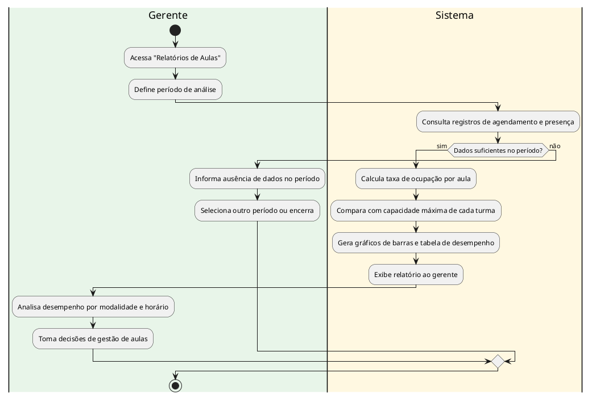
```plantuml
@startuml DA_UC17_OcupacaoAulas

|#E8F5E9|Gerente|
start
:Acessa "Relatórios de Aulas";
:Define período de análise;

|#FFF8E1|Sistema|
:Consulta registros de agendamento e presença;

if (Dados suficientes no período?) then (sim)
  :Calcula taxa de ocupação por aula;
  :Compara com capacidade máxima de cada turma;
  :Gera gráficos de barras e tabela de desempenho;
  :Exibe relatório ao gerente;
  |#E8F5E9|Gerente|
  :Analisa desempenho por modalidade e horário;
  :Toma decisões de gestão de aulas;
else (não)
  :Informa ausência de dados no período;
  |#E8F5E9|Gerente|
  :Seleciona outro período ou encerra;
endif

stop
@enduml
```

---

## UC18 — Consultar Histórico de Acessos

### Especificação

| Atributo | Descrição |
|---|---|
| **Identificador** | UC18 |
| **Nome** | Consultar Histórico de Acessos |
| **Ator Principal** | Gerente |
| **Objetivo** | Monitorar frequência e registros de entrada dos alunos na academia. |
| **Pré-condições** | Registros de catraca existentes (UC08). |
| **Pós-condições** | Histórico detalhado exibido com data, hora e status. |
| **RF Relacionados** | RF09, RF05 |
| **RNF Relacionados** | RNF02 — Segurança / RNF05 — Escalabilidade |
| **RN Relacionadas** | RN01, RN06 |

**Fluxo Principal:**
1. Gerente informa aluno ou período de busca.
2. Sistema recupera registros de entrada e saída.
3. Exibe histórico com destaque para acessos negados.

**Fluxos Alternativos:**
- **A1:** Acesso negado registrado → destacado em vermelho (RN01).

### Diagrama de Atividade

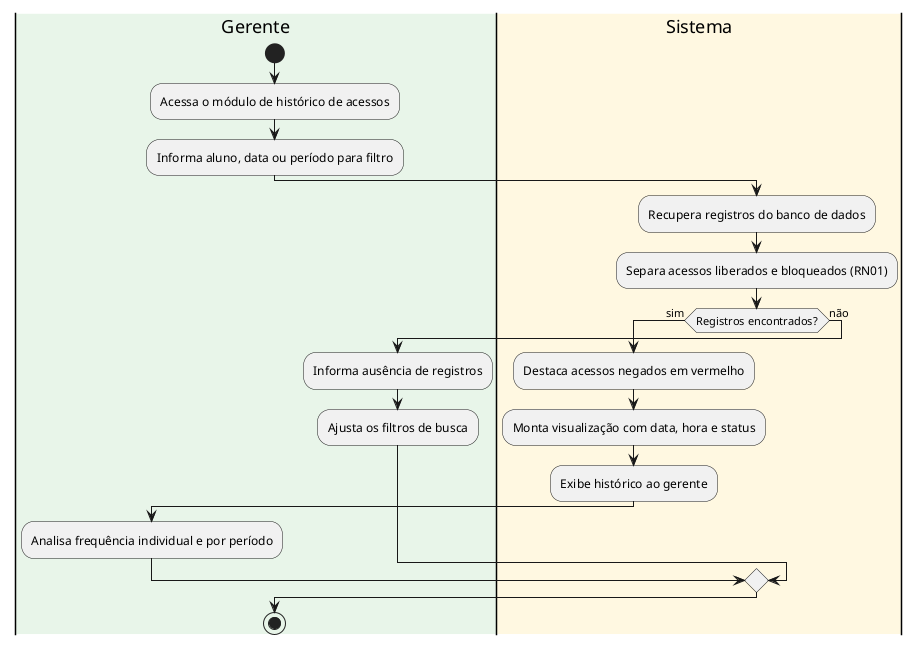
```plantuml
@startuml DA_UC18_HistoricoAcessos

|#E8F5E9|Gerente|
start
:Acessa o módulo de histórico de acessos;
:Informa aluno, data ou período para filtro;

|#FFF8E1|Sistema|
:Recupera registros do banco de dados;
:Separa acessos liberados e bloqueados (RN01);

if (Registros encontrados?) then (sim)
  :Destaca acessos negados em vermelho;
  :Monta visualização com data, hora e status;
  :Exibe histórico ao gerente;
  |#E8F5E9|Gerente|
  :Analisa frequência individual e por período;
else (não)
  :Informa ausência de registros;
  |#E8F5E9|Gerente|
  :Ajusta os filtros de busca;
endif

stop
@enduml
```

---

## UC19 — Notificar Vencimento de Mensalidade

### Especificação

| Atributo | Descrição |
|---|---|
| **Identificador** | UC19 |
| **Nome** | Notificar Vencimento de Mensalidade |
| **Ator Principal** | Sistema (automático) |
| **Objetivo** | Alertar o aluno sobre o prazo iminente de pagamento. |
| **Pré-condições** | Mensalidade com vencimento nos próximos 3 dias. |
| **Pós-condições** | Notificação enviada e registrada no log de comunicações. |
| **RF Relacionados** | RF10 |
| **RNF Relacionados** | RNF01 — Disponibilidade |
| **RN Relacionadas** | RN01 |

**Fluxo Principal:**
1. Sistema identifica parcelas com vencimento em até 3 dias.
2. Dispara notificação automática por e-mail ou push.
3. Registra envio no log de comunicações.

**Fluxos Alternativos:**
- **A1:** Falha no envio → sistema agenda nova tentativa em 4 horas.

### Diagrama de Atividade

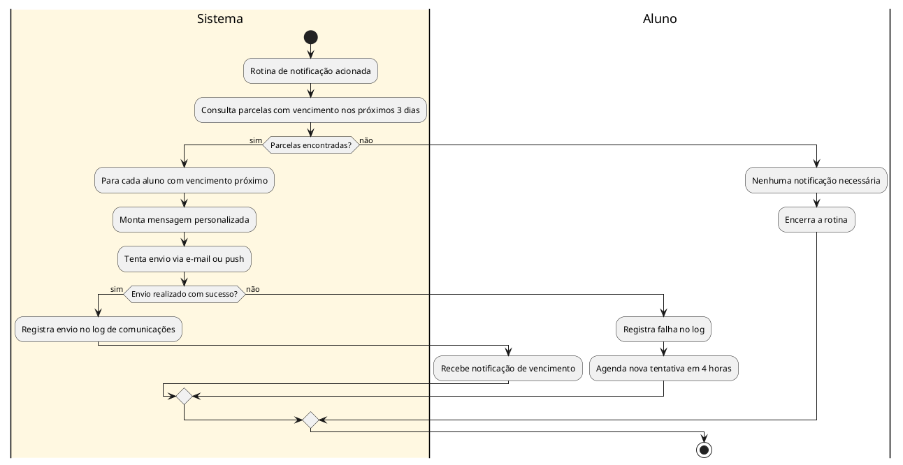
```plantuml
@startuml DA_UC19_NotificarVencimento

|#FFF8E1|Sistema|
start
:Rotina de notificação acionada;
:Consulta parcelas com vencimento nos próximos 3 dias;

if (Parcelas encontradas?) then (sim)
  :Para cada aluno com vencimento próximo;
  :Monta mensagem personalizada;
  :Tenta envio via e-mail ou push;

  if (Envio realizado com sucesso?) then (sim)
    :Registra envio no log de comunicações;
    |Aluno|
    :Recebe notificação de vencimento;
  else (não)
    :Registra falha no log;
    :Agenda nova tentativa em 4 horas;
  endif
else (não)
  :Nenhuma notificação necessária;
  :Encerra a rotina;
endif

stop
@enduml
```

---

## UC20 — Notificar Confirmação de Agendamento

### Especificação

| Atributo | Descrição |
|---|---|
| **Identificador** | UC20 |
| **Nome** | Notificar Confirmação de Agendamento |
| **Ator Principal** | Sistema (automático) |
| **Objetivo** | Confirmar formalmente ao aluno que sua vaga foi reservada. |
| **Pré-condições** | UC10 concluído com sucesso. |
| **Pós-condições** | Aluno notificado com os detalhes da aula agendada. |
| **RF Relacionados** | RF10 |
| **RNF Relacionados** | RNF01 — Disponibilidade |
| **RN Relacionadas** | RN02, RN03 |

**Fluxo Principal:**
1. Sistema recebe evento de conclusão do UC10.
2. Monta e envia notificação push ou e-mail com dados da aula.
3. Registra envio no log de comunicações.

**Fluxos Alternativos:**
- **A1:** Notificações desativadas → mantém apenas registro interno no portal.

### Diagrama de Atividade

```plantuml
@startuml DA_UC20_NotificarConfirmacao

|#FFF8E1|Sistema|
start
:Recebe evento de reserva confirmada (UC10);
:Busca dados da aula: modalidade, data e horário;
:Verifica configuração de notificações do aluno;

if (Notificações habilitadas?) then (sim)
  :Monta mensagem com detalhes da aula;
  :Envia via push ou e-mail;
  :Registra envio no log de comunicações;
  |#F3E5F5|Aluno|
  :Recebe confirmação com dados completos da aula;
else (não)
  :Cria registro interno no portal do aluno;
  :Registra evento no log sem envio externo;
  |#F3E5F5|Aluno|
  :Pode consultar confirmação pelo portal;
endif

stop
@enduml
```

---

*Documento elaborado por José Elias Pires Junior (24001702) e André Ricardo Monteiro Rocha (24001777) — UNIFEOB 2026.*
