# Entrega – Documento de Casos de Uso e Diagramas de Atividade

## Identificação

- Aluno 1: Nicolas Alexander
- Aluno 2: —

## Arquivos Entregues

### Diagrama de Casos de Uso
Arquivo entregue (PNG): `DUC_01_Nicolas.png`

### Documento de Casos de Uso e Diagramas de Atividade
Nome do arquivo entregue: `DOC_NicolasAlexander.md`

## Issues Relacionadas

> **Atenção:** As Issues devem ser **apenas referenciadas** — não utilize termos como *closes*, *fixes*, *resolve*.

- Relacionado à Issue **#1 – Documento de Casos de Uso**
- Relacionado à Issue **#2 – Diagrama de Casos de Uso**
- Relacionado à Issue **#3 – Diagramas de Atividade**

## Checklist Antes do Envio

- [x] O documento contém **20 casos de uso completos**, seguindo o template do arquivo `/docs/casosdeuso.md`
- [x] O nome do arquivo segue o padrão exigido
- [x] Os diagramas de casos de uso representam **todos os casos de uso listados** no documento
- [x] Os diagramas de atividade cobrem **todos os 20 casos de uso**
- [x] As Issues foram referenciadas corretamente
- [x] O PR contém **apenas** os arquivos exigidos

## Observações (Opcional)

Atividade realizada individualmente por Nicolas Alexander. O documento cobre os 20 casos de uso do sistema FitPass Gym Management, abrangendo os módulos de autenticação, cadastro de alunos, gerenciamento de planos, controle de pagamentos, validação de acesso via catraca RFID, agendamento de aulas, avaliações físicas, relatórios gerenciais e notificações automáticas. Todos os casos de uso foram relacionados aos Requisitos Funcionais (RF01–RF10), Requisitos Não Funcionais (RNF01–RNF06) e Regras de Negócio (RN01–RN07) fornecidos. Para cada caso de uso foi elaborado um diagrama de atividade em PlantUML com swimlanes.

---

## Diagrama de Casos de Uso

---

## Casos de Uso

---

### UC01 — Realizar Login

**Ator Principal**
Usuário (Aluno, Instrutor, Recepcionista, Gerente)

**Objetivo**
Permitir que o usuário acesse o sistema com suas credenciais.

**Pré-condições**
- O usuário deve possuir cadastro ativo no sistema.

**Pós-condições**
- Sessão iniciada com sucesso e usuário redirecionado à tela inicial conforme seu perfil.

**Fluxo Principal**
1. O usuário acessa a tela de login.
2. O usuário informa e-mail e senha.
3. O sistema valida as credenciais.
4. O sistema autentica o usuário e redireciona para a tela inicial correspondente ao seu perfil.

**Fluxos Alternativos**
- A1 — Senha incorreta: O sistema exibe mensagem de erro e permite nova tentativa.
- A2 — Conta bloqueada: O sistema impede o login e instrui o usuário a recuperar o acesso via e-mail.
- A3 — Usuário não encontrado: O sistema exibe mensagem informando que o e-mail não está cadastrado.

**RF Relacionados**
- RF04 — Regularidade do Aluno

**RNF Relacionados**
- RNF02 — Segurança
- RNF03 — Performance

**RN Relacionadas**
- RN06 — Acesso restrito por perfil

---

### UC02 — Cadastrar Aluno

**Ator Principal**
Recepcionista

**Objetivo**
Registrar um novo aluno no sistema com todos os dados pessoais e plano contratado.

**Pré-condições**
- A recepcionista deve estar autenticada no sistema.
- O CPF e o e-mail informados não podem estar vinculados a outro cadastro ativo.

**Pós-condições**
- Aluno cadastrado com sucesso e plano associado.
- Credenciais de acesso enviadas ao e-mail do aluno.

**Fluxo Principal**
1. A recepcionista acessa o menu "Cadastro de Alunos".
2. O sistema exibe o formulário de cadastro.
3. A recepcionista preenche: nome completo, CPF, data de nascimento, e-mail, telefone, endereço e plano contratado.
4. O sistema valida os dados informados.
5. O sistema salva o cadastro e gera login e senha provisória para o aluno.
6. O sistema envia e-mail de boas-vindas com as credenciais de acesso.

**Fluxos Alternativos**
- A1 — CPF ou e-mail já cadastrado: O sistema exibe mensagem de duplicidade e impede o cadastro.
- A2 — Campos obrigatórios não preenchidos: O sistema destaca os campos pendentes e solicita preenchimento.

**RF Relacionados**
- RF01 — Cadastro de Alunos
- RF02 — Gerenciamento de Planos

**RNF Relacionados**
- RNF02 — Segurança
- RNF04 — Usabilidade

**RN Relacionadas**
- RN06 — Acesso restrito por perfil

---

### UC03 — Editar Cadastro de Aluno

**Ator Principal**
Recepcionista

**Objetivo**
Atualizar informações cadastrais de um aluno já registrado no sistema.

**Pré-condições**
- A recepcionista deve estar autenticada.
- O aluno deve possuir cadastro ativo.

**Pós-condições**
- Dados do aluno atualizados com sucesso no sistema.
- Alteração registrada em log de auditoria.

**Fluxo Principal**
1. A recepcionista busca o aluno pelo nome ou CPF.
2. O sistema exibe os dados cadastrais atuais do aluno.
3. A recepcionista seleciona "Editar" e altera os campos desejados.
4. O sistema valida as alterações.
5. O sistema salva as alterações e registra data e hora da última atualização.

**Fluxos Alternativos**
- A1 — Aluno não encontrado: O sistema exibe mensagem e sugere verificar os dados de busca.
- A2 — Tentativa de alterar CPF: O sistema bloqueia a edição do campo CPF e orienta abrir solicitação administrativa.

**RF Relacionados**
- RF01 — Cadastro de Alunos

**RNF Relacionados**
- RNF02 — Segurança
- RNF04 — Usabilidade

**RN Relacionadas**
- RN06 — Acesso restrito por perfil

---

### UC04 — Gerenciar Planos

**Ator Principal**
Gerente

**Objetivo**
Criar, editar, ativar e desativar tipos de planos oferecidos pela academia.

**Pré-condições**
- O gerente deve estar autenticado no sistema.

**Pós-condições**
- Plano criado, editado ou com status atualizado com sucesso.

**Fluxo Principal**
1. O gerente acessa o menu "Planos".
2. O sistema lista os planos existentes com seus status (ativo/inativo).
3. O gerente seleciona a ação desejada: criar novo, editar ou alterar status.
4. O sistema exibe o formulário correspondente.
5. O gerente preenche ou altera: nome, descrição, valor, duração e modalidades inclusas.
6. O sistema valida e salva as informações.

**Fluxos Alternativos**
- A1 — Desativar plano com alunos vinculados: O sistema exibe aviso com a quantidade de alunos ativos e solicita confirmação antes de desativar.
- A2 — Valor inválido: O sistema rejeita valores negativos ou zerados e exibe mensagem de erro.

**RF Relacionados**
- RF02 — Gerenciamento de Planos

**RNF Relacionados**
- RNF02 — Segurança
- RNF05 — Escalabilidade

**RN Relacionadas**
- RN06 — Acesso restrito por perfil

---

### UC05 — Registrar Pagamento Presencial

**Ator Principal**
Recepcionista

**Objetivo**
Registrar o pagamento de mensalidade realizado presencialmente na recepção.

**Pré-condições**
- A recepcionista deve estar autenticada.
- O aluno deve possuir cadastro ativo.

**Pós-condições**
- Pagamento registrado e status de adimplência do aluno atualizado imediatamente.
- Comprovante de pagamento gerado.

**Fluxo Principal**
1. A recepcionista busca o aluno pelo nome ou CPF.
2. O sistema exibe as mensalidades em aberto do aluno.
3. A recepcionista seleciona a parcela a pagar e informa a forma de pagamento: dinheiro, cartão ou PIX.
4. O sistema registra o pagamento.
5. O sistema atualiza o status do aluno para "adimplente".
6. O sistema emite o comprovante de pagamento para impressão ou envio por e-mail.

**Fluxos Alternativos**
- A1 — Aluno não encontrado: O sistema exibe mensagem e sugere cadastrar o aluno.
- A2 — Tentativa de pagamento parcial: O sistema bloqueia a operação e informa que o pagamento deve ser integral.

**RF Relacionados**
- RF03 — Controle de Pagamentos
- RF04 — Regularidade do Aluno

**RNF Relacionados**
- RNF03 — Performance
- RNF04 — Usabilidade

**RN Relacionadas**
- RN04 — Pagamento parcial
- RN07 — Atualização automática da regularidade

---

### UC06 — Gerar Boleto / Link de Pagamento Online

**Ator Principal**
Sistema (automático) / Recepcionista

**Objetivo**
Gerar boleto bancário ou link de pagamento online para que o aluno quite sua mensalidade remotamente.

**Pré-condições**
- O aluno deve possuir cadastro ativo e mensalidade em aberto.

**Pós-condições**
- Boleto ou link de pagamento gerado e enviado ao aluno por e-mail.

**Fluxo Principal**
1. O sistema identifica alunos com mensalidades a vencer nos próximos 5 dias.
2. O sistema gera o boleto ou link de pagamento para cada aluno identificado.
3. O sistema envia o boleto/link por e-mail ao aluno.
4. Ao confirmar o pagamento, o sistema atualiza automaticamente o status do aluno para "adimplente".

**Fluxos Alternativos**
- A1 — Geração manual pela recepcionista: A recepcionista busca o aluno e aciona "Gerar Boleto/Link" manualmente.
- A2 — Falha no envio de e-mail: O sistema registra a falha e agenda novo envio em 1 hora; a recepcionista recebe alerta.

**RF Relacionados**
- RF03 — Controle de Pagamentos
- RF10 — Notificações

**RNF Relacionados**
- RNF01 — Disponibilidade
- RNF06 — Integração

**RN Relacionadas**
- RN04 — Pagamento parcial
- RN07 — Atualização automática da regularidade

---

### UC07 — Validar Acesso pela Catraca

**Ator Principal**
Catraca (RFID) / Aluno

**Objetivo**
Controlar a entrada do aluno na academia por meio de leitura de cartão RFID integrada ao sistema.

**Pré-condições**
- O aluno deve possuir cartão RFID vinculado ao seu cadastro.
- A integração entre o sistema e a catraca deve estar ativa.

**Pós-condições**
- Acesso liberado ou bloqueado conforme situação do aluno.
- Registro de entrada gerado no histórico de acessos.

**Fluxo Principal**
1. O aluno aproxima o cartão RFID da leitora da catraca.
2. A catraca envia o código RFID ao sistema via API REST.
3. O sistema verifica se o aluno está com cadastro ativo e mensalidade em dia.
4. O sistema retorna resposta de liberação à catraca.
5. A catraca libera a passagem e o sistema registra o acesso com data e hora.

**Fluxos Alternativos**
- A1 — Aluno inadimplente: O sistema retorna bloqueio; a catraca trava e orienta o aluno a regularizar na recepção.
- A2 — Cartão não reconhecido: O sistema retorna erro; a catraca trava e orienta o aluno a solicitar novo cartão na recepção.
- A3 — Sistema indisponível: A catraca opera em modo offline por até 15 minutos utilizando cache local de alunos autorizados.

**RF Relacionados**
- RF04 — Regularidade do Aluno
- RF05 — Controle de Acesso

**RNF Relacionados**
- RNF03 — Performance
- RNF06 — Integração

**RN Relacionadas**
- RN01 — Bloqueio por inadimplência

---

### UC08 — Agendar Aula

**Ator Principal**
Aluno

**Objetivo**
Permitir que o aluno visualize os horários disponíveis e reserve vaga em uma aula.

**Pré-condições**
- O aluno deve estar autenticado, com cadastro ativo e mensalidade em dia.
- A aula deve possuir vagas disponíveis.

**Pós-condições**
- Reserva confirmada e vaga descontada do total disponível na aula.
- Notificação de confirmação enviada ao aluno.

**Fluxo Principal**
1. O aluno acessa o menu "Aulas".
2. O sistema exibe as aulas disponíveis com horário, instrutor, modalidade e vagas restantes.
3. O aluno seleciona a aula desejada e confirma o agendamento.
4. O sistema verifica disponibilidade de vagas e situação do aluno.
5. O sistema registra a reserva e reduz o contador de vagas disponíveis.
6. O sistema envia notificação de confirmação ao aluno.

**Fluxos Alternativos**
- A1 — Aluno inadimplente: O sistema bloqueia o agendamento e orienta o aluno a regularizar o pagamento.
- A2 — Aula sem vagas: O sistema informa que a aula está lotada e sugere outras aulas disponíveis.
- A3 — Aluno já agendado na mesma aula: O sistema informa que já existe reserva para aquele horário.

**RF Relacionados**
- RF06 — Agendamento de Aulas
- RF10 — Notificações

**RNF Relacionados**
- RNF03 — Performance
- RNF04 — Usabilidade

**RN Relacionadas**
- RN01 — Bloqueio por inadimplência
- RN02 — Limite de vagas

---

### UC09 — Cancelar Agendamento de Aula

**Ator Principal**
Aluno

**Objetivo**
Permitir que o aluno cancele uma reserva de aula previamente realizada.

**Pré-condições**
- O aluno deve estar autenticado.
- Deve existir uma reserva ativa para a aula selecionada.
- O cancelamento deve ser realizado com pelo menos 1 hora de antecedência.

**Pós-condições**
- Reserva cancelada e vaga devolvida ao total disponível da aula.
- Notificação de cancelamento enviada ao aluno.

**Fluxo Principal**
1. O aluno acessa o menu "Meus Agendamentos".
2. O sistema lista as reservas ativas do aluno.
3. O aluno seleciona a aula que deseja cancelar e confirma o cancelamento.
4. O sistema verifica se o prazo mínimo de cancelamento ainda não foi atingido.
5. O sistema cancela a reserva e devolve a vaga ao total disponível.
6. O sistema envia notificação de cancelamento ao aluno.

**Fluxos Alternativos**
- A1 — Cancelamento fora do prazo: O sistema bloqueia o cancelamento e informa que o prazo mínimo de 1 hora antes da aula já foi ultrapassado.

**RF Relacionados**
- RF06 — Agendamento de Aulas
- RF10 — Notificações

**RNF Relacionados**
- RNF03 — Performance
- RNF04 — Usabilidade

**RN Relacionadas**
- RN03 — Cancelamento de agendamento

---

### UC10 — Registrar Presença em Aula

**Ator Principal**
Instrutor

**Objetivo**
Registrar a presença dos alunos participantes em uma aula ministrada.

**Pré-condições**
- O instrutor deve estar autenticado.
- A aula deve estar agendada para o dia e horário corrente.

**Pós-condições**
- Presenças registradas e histórico de frequência dos alunos atualizado.

**Fluxo Principal**
1. O instrutor acessa o menu "Minhas Aulas".
2. O sistema exibe as aulas do dia com a lista de alunos agendados.
3. O instrutor seleciona a aula e marca a presença dos alunos participantes.
4. O sistema salva o registro de presença com data, horário e nome do instrutor responsável.

**Fluxos Alternativos**
- A1 — Aluno presente sem agendamento: O instrutor pode incluir manualmente o aluno na lista de presença, justificando a inclusão.
- A2 — Aula sem alunos agendados: O sistema exibe aviso de lista vazia; o instrutor pode registrar encerramento da aula sem presenças.

**RF Relacionados**
- RF07 — Lista de Presença

**RNF Relacionados**
- RNF01 — Disponibilidade
- RNF03 — Performance

**RN Relacionadas**
- RN06 — Acesso restrito por perfil

---

### UC11 — Registrar Avaliação Física

**Ator Principal**
Instrutor

**Objetivo**
Registrar os dados de avaliação física de um aluno, incluindo métricas corporais e arquivos anexos.

**Pré-condições**
- O instrutor deve estar autenticado.
- O aluno deve possuir cadastro ativo e mensalidade em dia.

**Pós-condições**
- Avaliação física registrada e disponível no histórico do aluno.

**Fluxo Principal**
1. O instrutor acessa o menu "Avaliações Físicas".
2. O instrutor busca o aluno pelo nome ou CPF.
3. O sistema exibe o perfil do aluno e seu histórico de avaliações anteriores.
4. O instrutor preenche os dados da nova avaliação: peso, altura, IMC, percentual de gordura, medidas e observações.
5. O instrutor anexa arquivos complementares, se necessário (fotos, laudos).
6. O sistema salva a avaliação com data e nome do instrutor responsável.

**Fluxos Alternativos**
- A1 — Aluno inadimplente ou inativo: O sistema bloqueia o registro e orienta o instrutor a encaminhar o aluno à recepção.
- A2 — Formato de arquivo inválido: O sistema rejeita o anexo e informa os formatos aceitos (PDF, JPG, PNG).

**RF Relacionados**
- RF08 — Avaliação Física

**RNF Relacionados**
- RNF02 — Segurança
- RNF04 — Usabilidade

**RN Relacionadas**
- RN05 — Avaliação física
- RN06 — Acesso restrito por perfil

---

### UC12 — Consultar Histórico de Avaliações Físicas

**Ator Principal**
Aluno / Instrutor

**Objetivo**
Visualizar o histórico de avaliações físicas de um aluno ao longo do tempo.

**Pré-condições**
- O usuário deve estar autenticado.
- O aluno deve possuir ao menos uma avaliação registrada.

**Pós-condições**
- Histórico de avaliações exibido com evolução dos indicadores ao longo do tempo.

**Fluxo Principal**
1. O usuário acessa o menu "Avaliações Físicas".
2. O sistema exibe o histórico em ordem cronológica.
3. O usuário seleciona uma avaliação específica para visualizar os detalhes completos.
4. O sistema exibe os dados da avaliação selecionada, incluindo arquivos anexos e gráficos de evolução.

**Fluxos Alternativos**
- A1 — Sem avaliações registradas: O sistema exibe mensagem informando que não há avaliações para o aluno e orienta agendar uma com o instrutor.

**RF Relacionados**
- RF08 — Avaliação Física

**RNF Relacionados**
- RNF04 — Usabilidade

**RN Relacionadas**
- RN06 — Acesso restrito por perfil

---

### UC13 — Emitir Relatório de Inadimplência

**Ator Principal**
Gerente

**Objetivo**
Gerar relatório com a lista de alunos inadimplentes e o valor total em aberto.

**Pré-condições**
- O gerente deve estar autenticado no sistema.

**Pós-condições**
- Relatório de inadimplência gerado e disponível para download ou impressão.

**Fluxo Principal**
1. O gerente acessa o menu "Relatórios".
2. O gerente seleciona "Relatório de Inadimplência".
3. O gerente define os filtros: período, unidade e faixa de dias em atraso.
4. O sistema processa os dados e gera o relatório.
5. O sistema exibe: nome do aluno, plano, valor em aberto, dias de atraso e contato.
6. O gerente exporta o relatório em PDF ou CSV.

**Fluxos Alternativos**
- A1 — Nenhum aluno inadimplente no período: O sistema exibe mensagem informando ausência de registros.

**RF Relacionados**
- RF09 — Relatórios Gerenciais

**RNF Relacionados**
- RNF03 — Performance
- RNF05 — Escalabilidade

**RN Relacionadas**
- RN01 — Bloqueio por inadimplência
- RN06 — Acesso restrito por perfil

---

### UC14 — Emitir Relatório de Alunos Ativos

**Ator Principal**
Gerente

**Objetivo**
Gerar relatório com a lista de alunos com cadastro ativo e plano vigente.

**Pré-condições**
- O gerente deve estar autenticado no sistema.

**Pós-condições**
- Relatório de alunos ativos gerado e disponível para download ou impressão.

**Fluxo Principal**
1. O gerente acessa o menu "Relatórios".
2. O gerente seleciona "Relatório de Alunos Ativos".
3. O gerente define filtros opcionais: plano, modalidade e unidade.
4. O sistema processa e exibe: nome do aluno, plano, data de início, data de vencimento e status de adimplência.
5. O gerente exporta o relatório em PDF ou CSV.

**Fluxos Alternativos**
- A1 — Nenhum resultado para os filtros aplicados: O sistema exibe mensagem e sugere ampliar os filtros de busca.

**RF Relacionados**
- RF09 — Relatórios Gerenciais

**RNF Relacionados**
- RNF03 — Performance
- RNF05 — Escalabilidade

**RN Relacionadas**
- RN06 — Acesso restrito por perfil

---

### UC15 — Emitir Relatório de Histórico de Acessos

**Ator Principal**
Gerente

**Objetivo**
Gerar relatório com o histórico de entradas registradas pela catraca em um determinado período.

**Pré-condições**
- O gerente deve estar autenticado no sistema.
- Deve existir ao menos um registro de acesso no período selecionado.

**Pós-condições**
- Relatório de histórico de acessos gerado e disponível para download.

**Fluxo Principal**
1. O gerente acessa o menu "Relatórios".
2. O gerente seleciona "Histórico de Acessos".
3. O gerente define o período e, opcionalmente, filtra por aluno ou unidade.
4. O sistema exibe: nome do aluno, data, horário de entrada e status (liberado ou bloqueado).
5. O gerente exporta o relatório em PDF ou CSV.

**Fluxos Alternativos**
- A1 — Nenhum acesso registrado no período: O sistema exibe mensagem informando ausência de registros.

**RF Relacionados**
- RF05 — Controle de Acesso
- RF09 — Relatórios Gerenciais

**RNF Relacionados**
- RNF03 — Performance
- RNF06 — Integração

**RN Relacionadas**
- RN01 — Bloqueio por inadimplência
- RN06 — Acesso restrito por perfil

---

### UC16 — Emitir Relatório de Ocupação das Aulas

**Ator Principal**
Gerente

**Objetivo**
Gerar relatório com a taxa de ocupação das aulas por modalidade e horário.

**Pré-condições**
- O gerente deve estar autenticado no sistema.
- Devem existir aulas registradas no período selecionado.

**Pós-condições**
- Relatório gerado com indicadores de taxa de lotação por aula.

**Fluxo Principal**
1. O gerente acessa o menu "Relatórios".
2. O gerente seleciona "Ocupação das Aulas".
3. O gerente define o período e, opcionalmente, filtra por modalidade, instrutor ou unidade.
4. O sistema gera o relatório com: nome da aula, horário, vagas totais, vagas ocupadas, taxa de ocupação (%) e instrutor.
5. O gerente exporta o relatório em PDF ou CSV.

**Fluxos Alternativos**
- A1 — Nenhuma aula no período selecionado: O sistema exibe mensagem informando ausência de registros.

**RF Relacionados**
- RF06 — Agendamento de Aulas
- RF09 — Relatórios Gerenciais

**RNF Relacionados**
- RNF03 — Performance
- RNF05 — Escalabilidade

**RN Relacionadas**
- RN02 — Limite de vagas
- RN06 — Acesso restrito por perfil

---

### UC17 — Enviar Notificação de Vencimento de Mensalidade

**Ator Principal**
Sistema (automático)

**Objetivo**
Notificar automaticamente o aluno sobre o vencimento próximo ou já ocorrido da mensalidade.

**Pré-condições**
- O aluno deve possuir cadastro ativo com e-mail ou celular cadastrado.
- A mensalidade deve estar a 5 dias ou menos do vencimento, ou já vencida.

**Pós-condições**
- Notificação enviada ao aluno pelo canal configurado (e-mail e/ou push).
- Registro do envio salvo no histórico de notificações do aluno.

**Fluxo Principal**
1. O sistema executa rotina diária de verificação de vencimentos.
2. O sistema identifica alunos com mensalidade vencendo em até 5 dias ou já vencida.
3. Para cada aluno identificado, o sistema gera a mensagem com valor e data de vencimento.
4. O sistema envia a notificação por e-mail e/ou push notification.
5. O sistema registra o envio com data, hora e canal utilizado.

**Fluxos Alternativos**
- A1 — Falha no envio: O sistema registra a falha e agenda nova tentativa em 2 horas; após 3 falhas, gera alerta para a recepcionista.

**RF Relacionados**
- RF04 — Regularidade do Aluno
- RF10 — Notificações

**RNF Relacionados**
- RNF01 — Disponibilidade
- RNF02 — Segurança

**RN Relacionadas**
- RN01 — Bloqueio por inadimplência
- RN07 — Atualização automática da regularidade

---

### UC18 — Enviar Notificação de Confirmação de Agendamento

**Ator Principal**
Sistema (automático)

**Objetivo**
Notificar o aluno sobre a confirmação de uma reserva de aula realizada.

**Pré-condições**
- O aluno deve ter realizado um agendamento de aula com sucesso (UC08).
- O aluno deve possuir e-mail ou celular cadastrado.

**Pós-condições**
- Notificação de confirmação enviada ao aluno com os detalhes da aula agendada.

**Fluxo Principal**
1. Após o registro bem-sucedido de um agendamento, o sistema gera automaticamente a notificação.
2. O sistema envia ao aluno: nome da aula, data, horário, local e nome do instrutor.
3. O sistema registra o envio no histórico de notificações do aluno.

**Fluxos Alternativos**
- A1 — Falha no envio: O sistema registra a falha e agenda nova tentativa em 30 minutos.

**RF Relacionados**
- RF06 — Agendamento de Aulas
- RF10 — Notificações

**RNF Relacionados**
- RNF03 — Performance
- RNF04 — Usabilidade

**RN Relacionadas**
- RN02 — Limite de vagas

---

### UC19 — Notificar Liberação de Nova Avaliação Física

**Ator Principal**
Sistema (automático)

**Objetivo**
Notificar o aluno quando uma nova avaliação física estiver disponível para agendamento.

**Pré-condições**
- O aluno deve possuir cadastro ativo e mensalidade em dia.
- Deve ter decorrido o período mínimo de 30 dias desde a última avaliação.

**Pós-condições**
- Notificação enviada ao aluno informando que ele pode agendar nova avaliação física.

**Fluxo Principal**
1. O sistema executa rotina diária verificando alunos elegíveis para nova avaliação.
2. O sistema identifica alunos com 30 ou mais dias desde a última avaliação, com cadastro ativo e adimplentes.
3. O sistema gera e envia notificação orientando o aluno a agendar a avaliação com um instrutor.
4. O sistema registra o envio no histórico de notificações.

**Fluxos Alternativos**
- A1 — Aluno sem avaliação anterior: O sistema envia notificação convidando o aluno a realizar a primeira avaliação.
- A2 — Aluno inadimplente no momento da verificação: O sistema suprime o envio e aguarda a regularização.

**RF Relacionados**
- RF08 — Avaliação Física
- RF10 — Notificações

**RNF Relacionados**
- RNF01 — Disponibilidade

**RN Relacionadas**
- RN01 — Bloqueio por inadimplência
- RN05 — Avaliação física

---

### UC20 — Desativar Cadastro de Aluno

**Ator Principal**
Recepcionista / Gerente

**Objetivo**
Encerrar o vínculo ativo do aluno com a academia, desativando seu acesso e registrando o motivo do encerramento.

**Pré-condições**
- O usuário deve estar autenticado.
- O aluno deve possuir cadastro ativo.

**Pós-condições**
- Cadastro do aluno marcado como inativo.
- Acesso à catraca revogado imediatamente via API.
- Histórico do aluno preservado para consulta futura.

**Fluxo Principal**
1. A recepcionista ou o gerente busca o aluno pelo nome ou CPF.
2. O sistema exibe o cadastro ativo do aluno.
3. O usuário seleciona "Desativar Cadastro" e informa o motivo.
4. O sistema solicita confirmação da ação.
5. O usuário confirma a desativação.
6. O sistema marca o cadastro como inativo, revoga o acesso à catraca via API REST e registra data, hora e responsável.

**Fluxos Alternativos**
- A1 — Aluno com mensalidade em aberto: O sistema exibe aviso sobre o débito pendente e solicita confirmação antes de prosseguir.
- A2 — Aluno com agendamentos futuros: O sistema lista os agendamentos ativos, cancela todos automaticamente e notifica o aluno.

**RF Relacionados**
- RF01 — Cadastro de Alunos
- RF05 — Controle de Acesso

**RNF Relacionados**
- RNF02 — Segurança
- RNF06 — Integração

**RN Relacionadas**
- RN06 — Acesso restrito por perfil

---

## Diagramas de Atividade

---

### DA01 — Realizar Login (UC01)

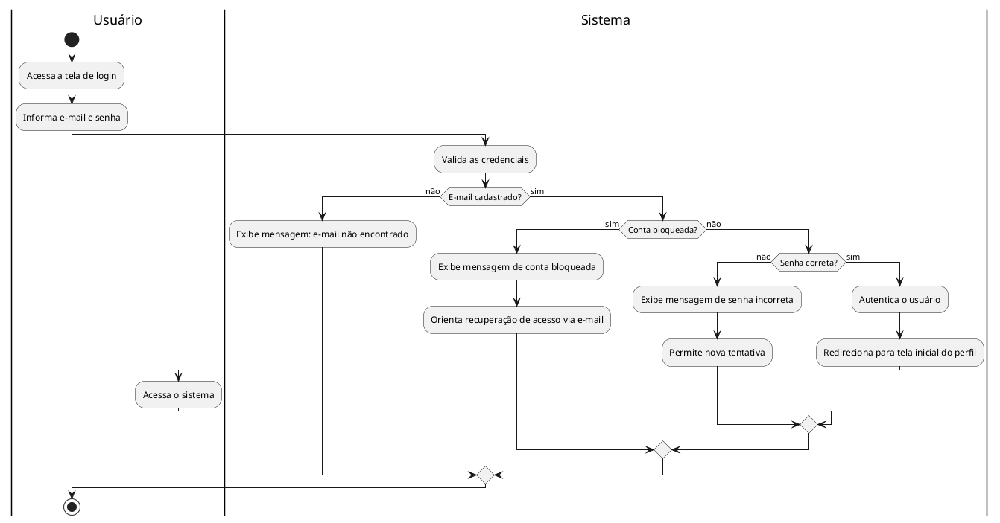

---

### DA02 — Cadastrar Aluno (UC02)

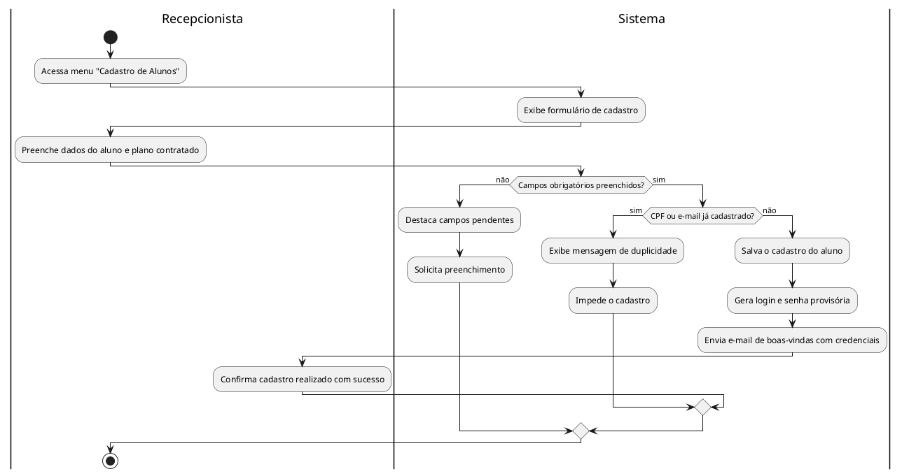

---

### DA03 — Editar Cadastro de Aluno (UC03)

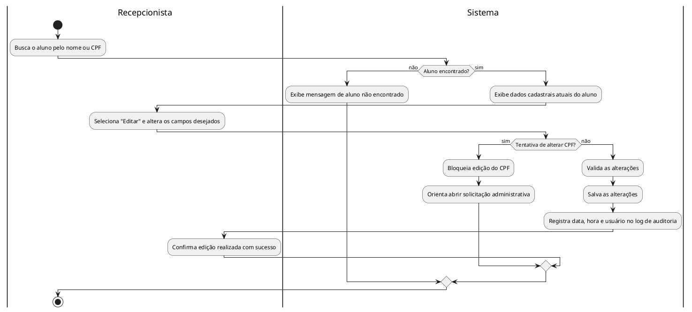

---

### DA04 — Gerenciar Planos (UC04)

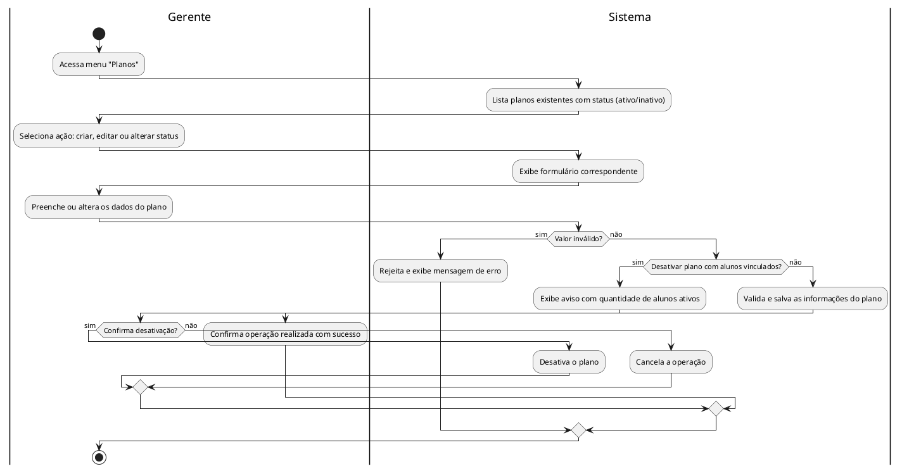

---

### DA05 — Registrar Pagamento Presencial (UC05)

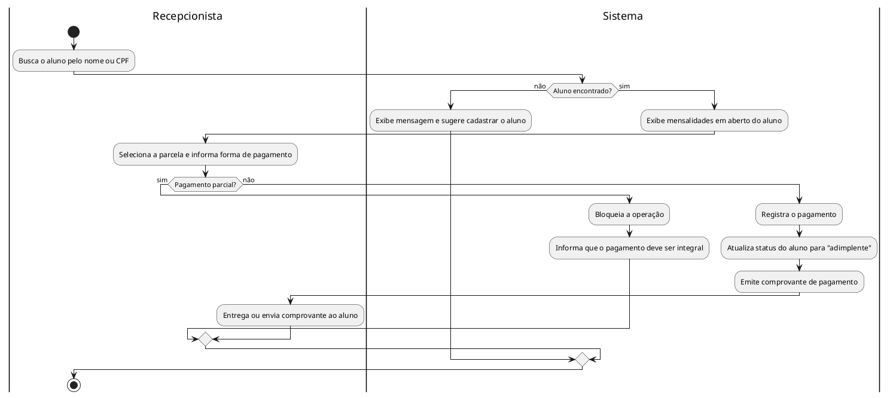

---

### DA06 — Gerar Boleto / Link de Pagamento Online (UC06)

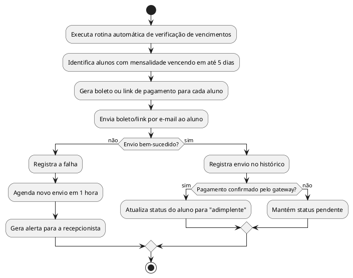

---

### DA07 — Validar Acesso pela Catraca (UC07)

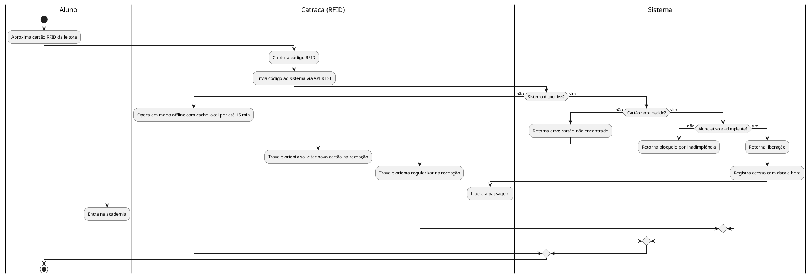

---

### DA08 — Agendar Aula (UC08)

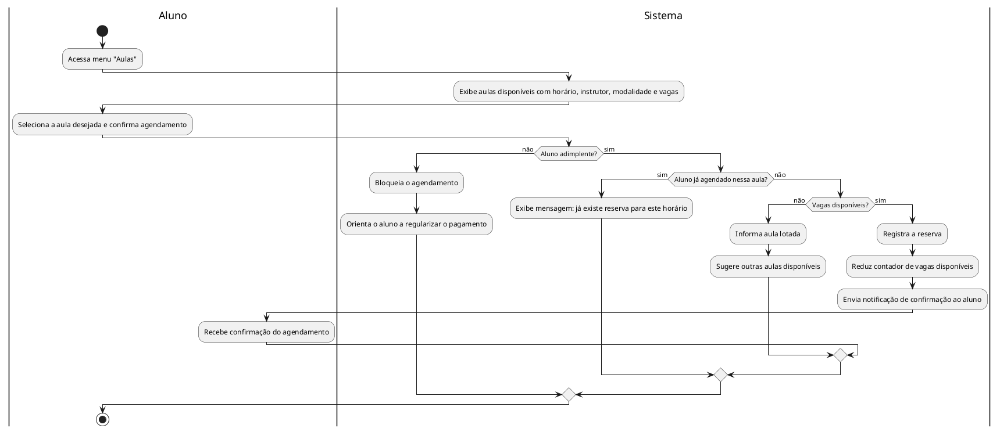

---

### DA09 — Cancelar Agendamento de Aula (UC09)

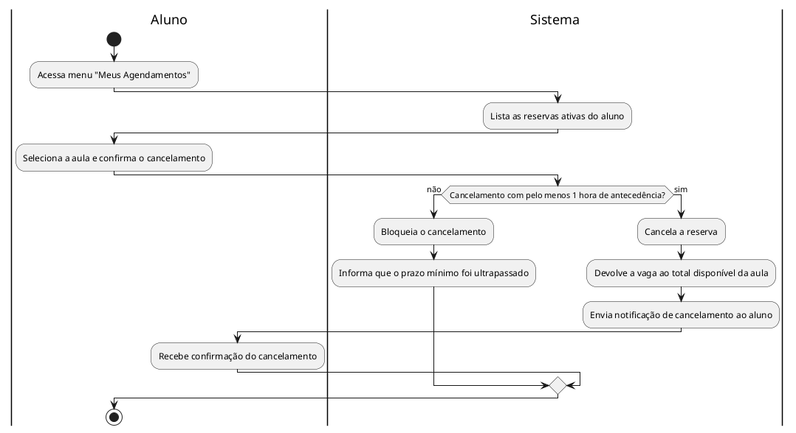

---

### DA10 — Registrar Presença em Aula (UC10)

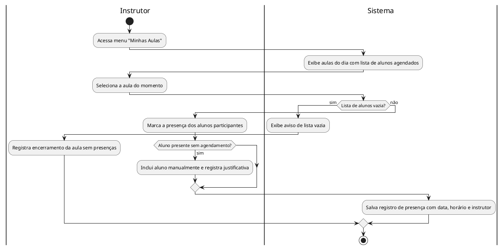

---

### DA11 — Registrar Avaliação Física (UC11)

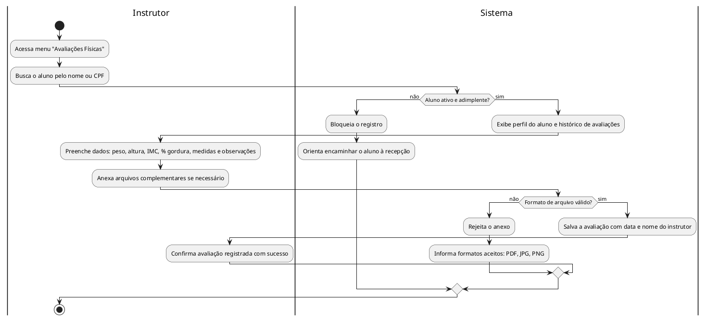

---

### DA12 — Consultar Histórico de Avaliações Físicas (UC12)

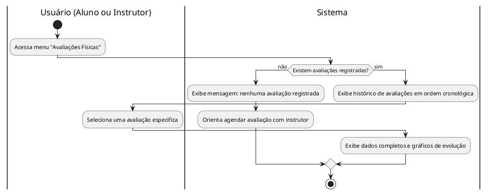

---

### DA13 — Emitir Relatório de Inadimplência (UC13)

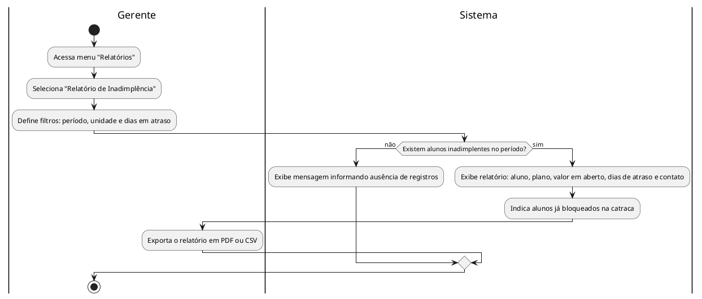

---

### DA14 — Emitir Relatório de Alunos Ativos (UC14)

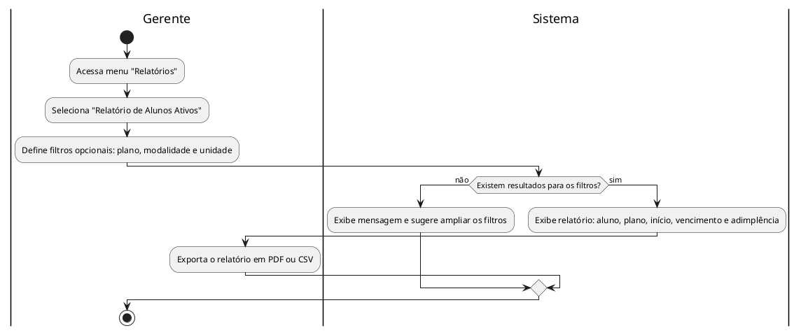

---

### DA15 — Emitir Relatório de Histórico de Acessos (UC15)

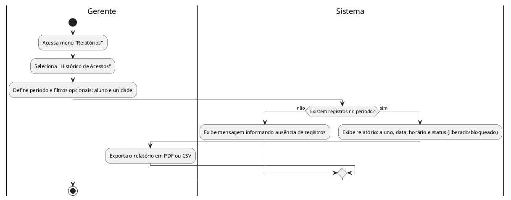

---

### DA16 — Emitir Relatório de Ocupação das Aulas (UC16)

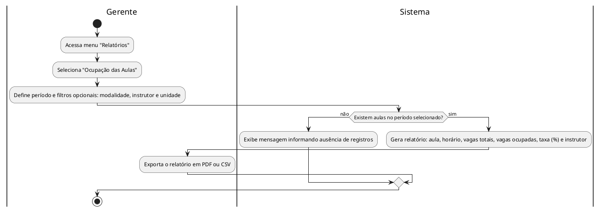

---

### DA17 — Enviar Notificação de Vencimento de Mensalidade (UC17)

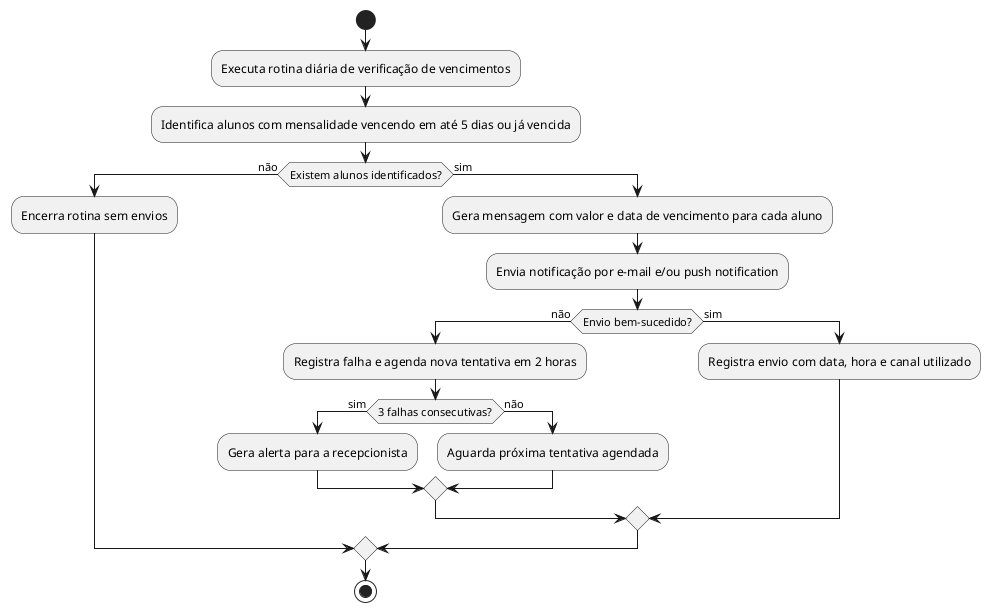

---

### DA18 — Enviar Notificação de Confirmação de Agendamento (UC18)

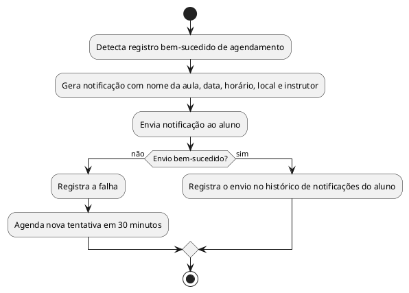

---

### DA19 — Notificar Liberação de Nova Avaliação Física (UC19)

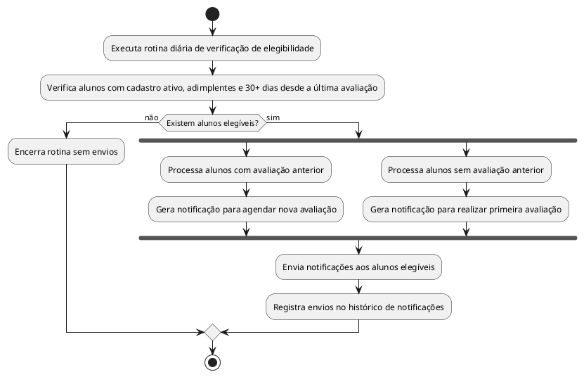

---

### DA20 — Desativar Cadastro de Aluno (UC20)

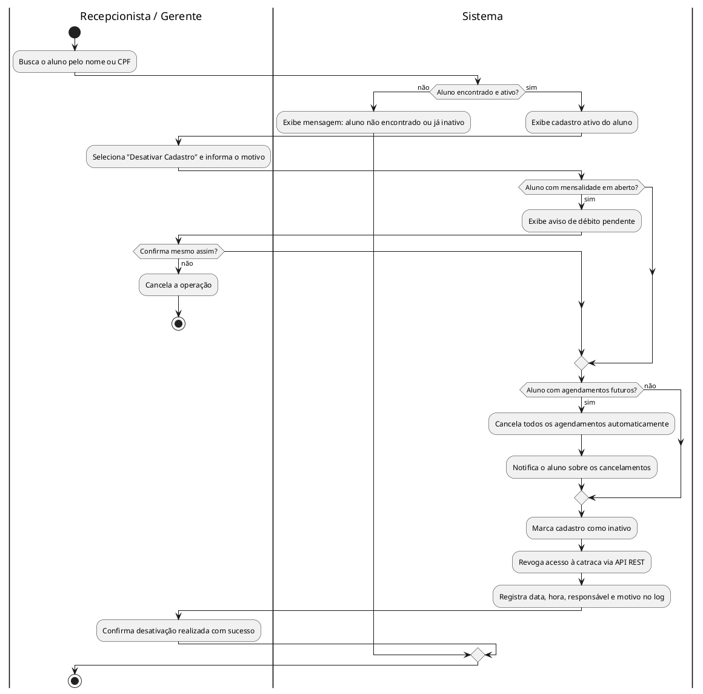
