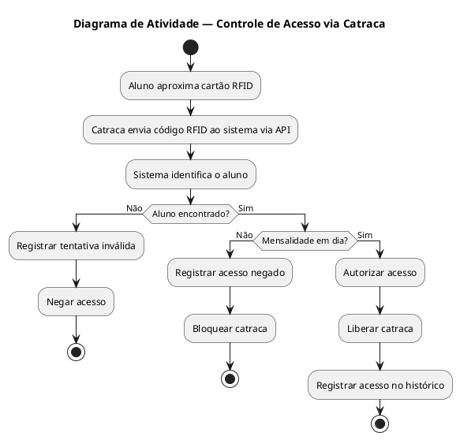
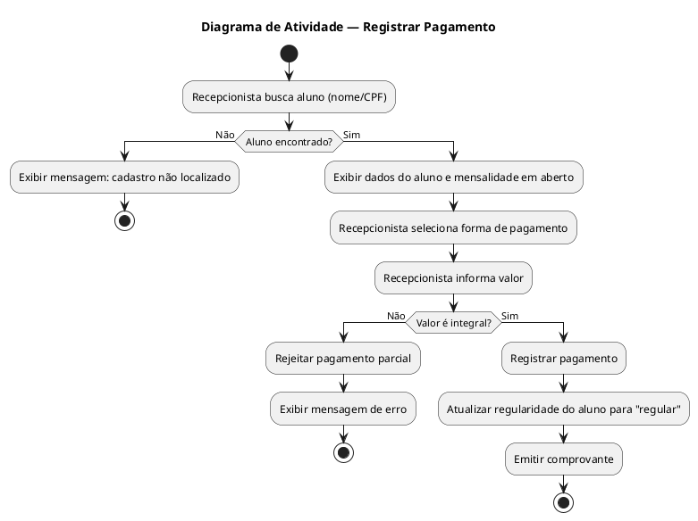
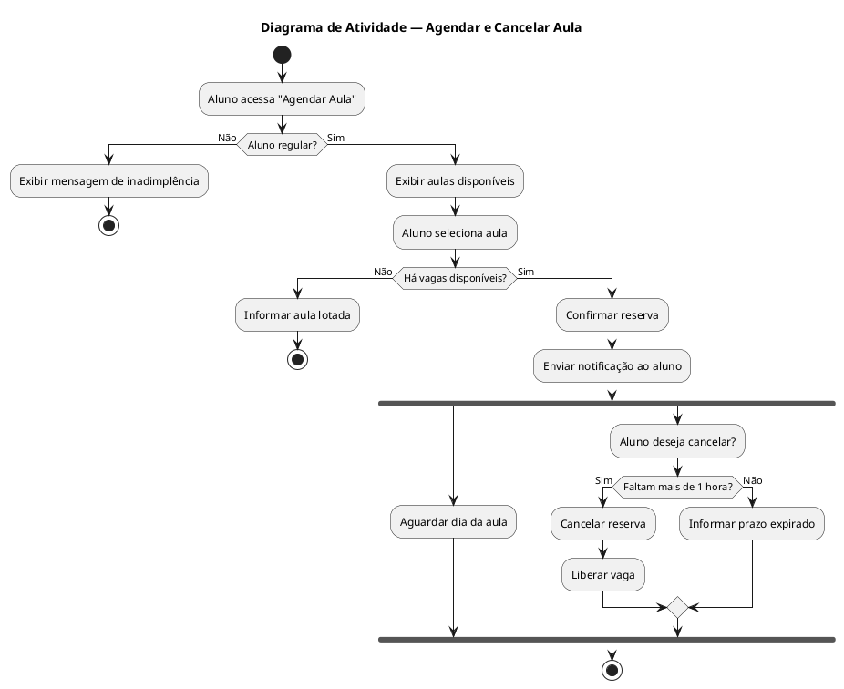
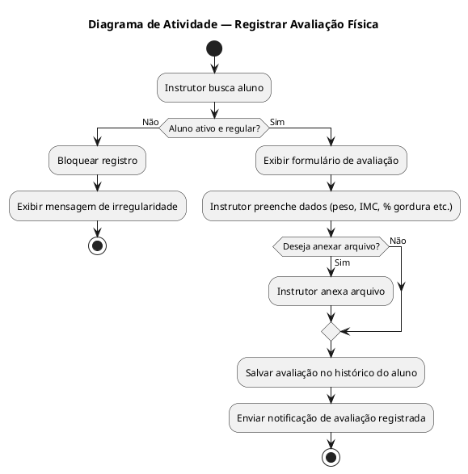
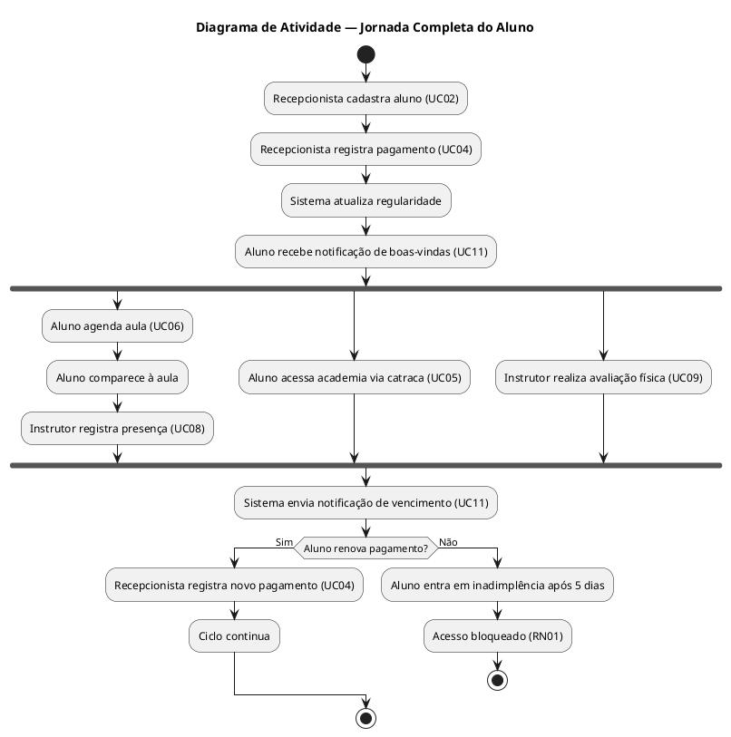

# Documento de Casos de Uso e Diagramas de Atividade
## Sistema FitPass Gym Management

---

## UC01 — Realizar Login

### Ator Principal
Usuário (Recepcionista, Instrutor, Gerente)

### Objetivo
Permitir que o usuário acesse o sistema com suas credenciais.

### Pré-condições
- Usuário deve possuir cadastro ativo no sistema.

### Pós-condições
- Sessão iniciada com sucesso e usuário redirecionado à tela inicial conforme seu perfil.

### Fluxo Principal
1. O usuário acessa a tela de login.
2. O usuário informa e-mail e senha.
3. O sistema valida as credenciais.
4. O sistema autentica o usuário e redireciona para a tela inicial de acordo com o perfil.

### Fluxos Alternativos
- **A1 — Senha incorreta:**  
  O sistema exibe mensagem de erro e permite nova tentativa.
- **A2 — Conta bloqueada:**  
  O sistema impede o login e instrui o usuário a entrar em contato com o administrador.

### RF Relacionados
- (Não há RF específico listado; login é pré-requisito funcional do sistema)

### RNF Relacionados
- RNF02 — Segurança (credenciais criptografadas)
- RNF03 — Performance (resposta em até 3 segundos)

### RN Relacionadas
- RN06 — Acesso restrito por perfil

---

## UC02 — Cadastrar Aluno

### Ator Principal
Recepcionista

### Objetivo
Registrar um novo aluno no sistema com todos os seus dados pessoais e plano contratado.

### Pré-condições
- Recepcionista autenticado no sistema.
- Planos disponíveis cadastrados.

### Pós-condições
- Aluno cadastrado e ativo no sistema.
- Cartão/credencial RFID associada ao aluno.

### Fluxo Principal
1. A recepcionista acessa a opção "Cadastrar Aluno".
2. O sistema exibe o formulário de cadastro.
3. A recepcionista preenche dados pessoais, contato, endereço e seleciona o plano.
4. O sistema valida os dados informados.
5. O sistema salva o cadastro e gera a credencial do aluno.
6. O sistema exibe confirmação do cadastro.

### Fluxos Alternativos
- **A1 — Dados inválidos ou incompletos:**  
  O sistema destaca os campos com erro e solicita correção.
- **A2 — Aluno já cadastrado (CPF duplicado):**  
  O sistema informa que o CPF já existe e impede novo cadastro.

### RF Relacionados
- RF01 — Cadastro de Alunos

### RNF Relacionados
- RNF02 — Segurança
- RNF04 — Usabilidade

### RN Relacionadas
- RN06 — Acesso restrito por perfil (somente Recepcionista)

---

## UC03 — Gerenciar Planos

### Ator Principal
Gerente

### Objetivo
Criar, editar, ativar ou desativar planos oferecidos pela academia.

### Pré-condições
- Gerente autenticado no sistema.

### Pós-condições
- Plano criado, editado, ativado ou desativado com sucesso.

### Fluxo Principal
1. O gerente acessa o menu "Planos".
2. O sistema lista os planos existentes.
3. O gerente seleciona criar novo ou editar um plano existente.
4. O gerente preenche/altera os dados (nome, valor, duração, modalidade).
5. O sistema valida e salva as alterações.
6. O sistema exibe confirmação.

### Fluxos Alternativos
- **A1 — Desativar plano com alunos vinculados:**  
  O sistema alerta que existem alunos ativos nesse plano e solicita confirmação.
- **A2 — Dados inválidos:**  
  O sistema exibe mensagem de erro nos campos inválidos.

### RF Relacionados
- RF02 — Gerenciamento de Planos

### RNF Relacionados
- RNF04 — Usabilidade
- RNF05 — Escalabilidade

### RN Relacionadas
- RN06 — Acesso restrito por perfil (somente Gerente)

---

## UC04 — Registrar Pagamento

### Ator Principal
Recepcionista

### Objetivo
Registrar o pagamento da mensalidade de um aluno e atualizar sua situação de regularidade.

### Pré-condições
- Recepcionista autenticado.
- Aluno cadastrado no sistema.

### Pós-condições
- Pagamento registrado.
- Situação do aluno atualizada para "regular".

### Fluxo Principal
1. A recepcionista busca o aluno pelo nome ou CPF.
2. O sistema exibe os dados do aluno e a mensalidade em aberto.
3. A recepcionista seleciona a forma de pagamento (dinheiro, cartão ou PIX).
4. O sistema registra o pagamento pelo valor integral.
5. O sistema atualiza imediatamente a regularidade do aluno.
6. O sistema emite comprovante.

### Fluxos Alternativos
- **A1 — Tentativa de pagamento parcial:**  
  O sistema rejeita e informa que apenas o valor integral é aceito.
- **A2 — Aluno não encontrado:**  
  O sistema informa que o cadastro não foi localizado.

### RF Relacionados
- RF03 — Controle de Pagamentos
- RF04 — Regularidade do Aluno

### RNF Relacionados
- RNF03 — Performance

### RN Relacionadas
- RN04 — Pagamento parcial não permitido
- RN07 — Atualização automática da regularidade

---

## UC05 — Controlar Acesso (Catraca)

### Ator Principal
Sistema de Catraca (ator secundário: Aluno)

### Objetivo
Validar automaticamente a entrada do aluno pela integração com a catraca via RFID.

### Pré-condições
- Aluno com credencial RFID ativa.
- Integração com a catraca funcionando.

### Pós-condições
- Acesso liberado ou negado e registro do evento salvo.

### Fluxo Principal
1. O aluno aproxima o cartão RFID da catraca.
2. A catraca envia o código RFID ao sistema via API REST.
3. O sistema identifica o aluno.
4. O sistema verifica se o aluno está ativo e com mensalidade em dia.
5. O sistema retorna autorização e a catraca libera a passagem.
6. O sistema registra o acesso no histórico.

### Fluxos Alternativos
- **A1 — Mensalidade vencida há mais de 5 dias:**  
  O sistema nega o acesso e a catraca permanece bloqueada.
- **A2 — RFID não reconhecido:**  
  O sistema nega o acesso e registra tentativa inválida.

### RF Relacionados
- RF04 — Regularidade do Aluno
- RF05 — Controle de Acesso

### RNF Relacionados
- RNF03 — Performance (resposta em até 3 segundos)
- RNF06 — Integração via API REST/JSON

### RN Relacionadas
- RN01 — Bloqueio por inadimplência

---

## UC06 — Agendar Aula

### Ator Principal
Aluno

### Objetivo
Permitir que o aluno visualize os horários disponíveis e reserve uma vaga em uma aula.

### Pré-condições
- Aluno autenticado no sistema.
- Aluno com mensalidade em dia.
- Aulas disponíveis com vagas abertas.

### Pós-condições
- Reserva confirmada e notificação enviada ao aluno.

### Fluxo Principal
1. O aluno acessa "Agendar Aula".
2. O sistema exibe as aulas disponíveis com horários e vagas restantes.
3. O aluno seleciona a aula desejada.
4. O sistema verifica a disponibilidade de vagas.
5. O sistema confirma a reserva e envia notificação ao aluno.

### Fluxos Alternativos
- **A1 — Aula sem vagas:**  
  O sistema informa que a aula está lotada e bloqueia o agendamento.
- **A2 — Aluno inadimplente:**  
  O sistema impede o agendamento e informa a situação.

### RF Relacionados
- RF06 — Agendamento de Aulas
- RF10 — Notificações (confirmação de agendamento)

### RNF Relacionados
- RNF04 — Usabilidade

### RN Relacionadas
- RN02 — Limite de vagas
- RN01 — Bloqueio por inadimplência

---

## UC07 — Cancelar Agendamento

### Ator Principal
Aluno

### Objetivo
Permitir que o aluno cancele uma reserva de aula dentro do prazo permitido.

### Pré-condições
- Aluno autenticado.
- Reserva existente e com mais de 1 hora de antecedência em relação ao início da aula.

### Pós-condições
- Reserva cancelada e vaga liberada para outros alunos.

### Fluxo Principal
1. O aluno acessa "Meus Agendamentos".
2. O sistema lista as reservas ativas.
3. O aluno seleciona a reserva e solicita cancelamento.
4. O sistema verifica se o cancelamento está dentro do prazo.
5. O sistema cancela a reserva e libera a vaga.

### Fluxos Alternativos
- **A1 — Cancelamento fora do prazo (menos de 1 hora antes):**  
  O sistema informa que o prazo expirou e não permite cancelamento.

### RF Relacionados
- RF06 — Agendamento de Aulas

### RNF Relacionados
- RNF04 — Usabilidade

### RN Relacionadas
- RN03 — Cancelamento de agendamento

---

## UC08 — Registrar Presença em Aula

### Ator Principal
Instrutor

### Objetivo
Registrar a presença dos alunos em uma aula ministrada.

### Pré-condições
- Instrutor autenticado.
- Aula ativa no horário corrente.

### Pós-condições
- Presenças registradas no histórico da aula.

### Fluxo Principal
1. O instrutor acessa a aula em andamento.
2. O sistema exibe a lista de alunos agendados.
3. O instrutor marca a presença dos alunos presentes.
4. O sistema salva o registro de presença.

### Fluxos Alternativos
- **A1 — Aluno presente sem agendamento:**  
  O instrutor pode adicionar o aluno manualmente, se houver vaga.

### RF Relacionados
- RF07 — Lista de Presença

### RNF Relacionados
- RNF04 — Usabilidade

### RN Relacionadas
- RN06 — Acesso restrito por perfil (somente Instrutor)

---

## UC09 — Registrar Avaliação Física

### Ator Principal
Instrutor

### Objetivo
Registrar os dados de avaliação física do aluno (peso, IMC, percentual de gordura etc.).

### Pré-condições
- Instrutor autenticado.
- Aluno ativo e regular (mensalidade em dia).

### Pós-condições
- Avaliação registrada e disponível no histórico do aluno.

### Fluxo Principal
1. O instrutor busca o aluno.
2. O sistema verifica que o aluno está ativo e regular.
3. O instrutor preenche os dados da avaliação (peso, IMC, % gordura etc.).
4. O instrutor anexa arquivo se necessário.
5. O sistema salva a avaliação.

### Fluxos Alternativos
- **A1 — Aluno inadimplente:**  
  O sistema bloqueia o registro e informa que o aluno não está regular.

### RF Relacionados
- RF08 — Avaliação Física
- RF10 — Notificações (liberação de nova avaliação)

### RNF Relacionados
- RNF02 — Segurança

### RN Relacionadas
- RN05 — Avaliação física somente para aluno ativo e regular
- RN06 — Acesso restrito por perfil (somente Instrutor)

---

## UC10 — Emitir Relatórios Gerenciais

### Ator Principal
Gerente

### Objetivo
Gerar relatórios sobre inadimplência, alunos ativos, histórico de acessos e ocupação das aulas.

### Pré-condições
- Gerente autenticado no sistema.

### Pós-condições
- Relatório gerado e disponível para visualização ou exportação.

### Fluxo Principal
1. O gerente acessa o menu "Relatórios".
2. O sistema exibe os tipos de relatório disponíveis.
3. O gerente seleciona o tipo e define os filtros (período, unidade etc.).
4. O sistema processa e exibe o relatório.
5. O gerente pode exportar o relatório.

### Fluxos Alternativos
- **A1 — Nenhum dado encontrado para os filtros:**  
  O sistema informa que não há dados para o período selecionado.

### RF Relacionados
- RF09 — Relatórios Gerenciais

### RNF Relacionados
- RNF05 — Escalabilidade
- RNF03 — Performance

### RN Relacionadas
- RN06 — Acesso restrito por perfil (somente Gerente)

---

## UC11 — Enviar Notificações

### Ator Principal
Sistema (automático)

### Objetivo
Enviar notificações automáticas ao aluno sobre vencimento de mensalidade, confirmação de agendamento e liberação de nova avaliação física.

### Pré-condições
- Aluno com e-mail ou contato cadastrado.
- Evento disparador ocorrido (vencimento próximo, agendamento realizado, avaliação liberada).

### Pós-condições
- Notificação enviada e registrada no sistema.

### Fluxo Principal
1. O sistema identifica o evento disparador.
2. O sistema localiza os dados de contato do aluno.
3. O sistema gera e envia a notificação.
4. O sistema registra o envio.

### Fluxos Alternativos
- **A1 — Falha no envio:**  
  O sistema registra o erro e agenda nova tentativa.

### RF Relacionados
- RF10 — Notificações

### RNF Relacionados
- RNF01 — Disponibilidade

### RN Relacionadas
- RN01 — Bloqueio por inadimplência (notificação prévia)

---

## Diagramas de Atividade

### DA01 — Controle de Acesso via Catraca (UC05)

---

### DA02 — Registrar Pagamento (UC04)

---

### DA03 — Agendar Aula (UC06 + UC07)

---

### DA04 — Avaliação Física (UC09)

---

### DA05 — Fluxo Completo do Aluno (Visão Geral)

